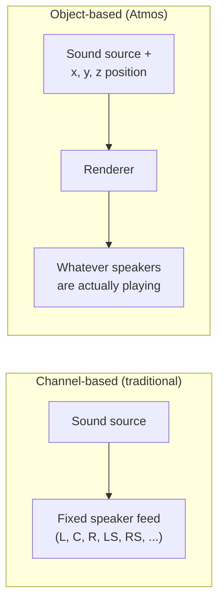
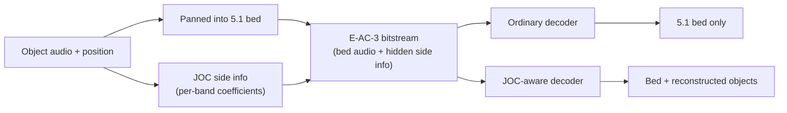

# Atmos & JOC

[Concepts](index.md) introduced Dolby Atmos as E-AC-3 (see [AC-3 & E-AC-3](ac3-eac3.md)) plus
an extra object layer. This page explains what an "object" is, how that layer actually rides
inside an ordinary E-AC-3 stream, and two honest limitations of the technique.

## Channels vs. objects

A traditional, channel-based mix locks each sound to a fixed speaker — or blends it between a
couple of fixed speakers — at the time the mix is made. The mix engineer decides "this sound
goes to left-surround" and it stays there, however many speakers the eventual listener has.

An **object**, instead, is a sound plus a position in 3D space (left/right, front/back,
up/down) — and that position can move over time. The mix carries the sound and its position,
not a decision about which speaker plays it. It's the **decoder/renderer**, at playback time,
that works out how to spread the object across whatever speakers are actually present —
5.1, 7.1.4, a soundbar, headphones — rather than the engineer baking in one fixed layout
months earlier.

## How Atmos actually rides inside E-AC-3

Atmos-in-E-AC-3 is not a second, separate bitstream sitting next to the first. It's one
E-AC-3 stream, built like this:

1. At encode time, each object gets **panned into the ordinary 5.1 bed** — mixed down into the
   same five directional channels plus LFE that a plain E-AC-3 stream would carry anyway. A
   receiver with no idea objects exist just plays that bed and hears a sensible 5.1 mix.
2. In parallel, **JOC** (Joint Object Coding) computes extra per-band "side information" —
   coefficients that describe how each object was panned into the bed, band by band. A
   JOC-aware decoder can use those coefficients to run the panning backwards and pull each
   object's audio back out of the bed.

Both paths produce the same one E-AC-3 bitstream. What a given decoder gets out of it depends
entirely on whether it knows to look for the side information.

## OAMD

**OAMD** (Object Audio MetaData) is where the position, size and motion data for each object
actually lives — the "x, y, z position" in the diagram above, per object, per unit of time.
It's the metadata a renderer reads to know where each object should be placed.

## EMDF

**EMDF** (Extensible Metadata Delivery Format) is the generic, extensible container format
that OAMD and JOC's side information both ride inside. Think of it as an envelope: it's tucked
into parts of the E-AC-3 bitstream — auxiliary data and per-block skip fields — that the
standard requires older decoders to simply skip over, since they don't know what's in them.
That skip behaviour is *how* backward compatibility works: an old decoder ignores the EMDF
envelope entirely and just plays the 5.1 bed underneath, no crash, no confusion, no awareness
that objects were ever there.

## Taking the object layer back out

The same property makes the reverse operation trivial to define and exact to perform. Because
the bed **is** the full mix and the object layer only ever rides in skip fields, a DD+ JOC
stream can be turned back into a plain DD+ 5.1 stream by removing the container — no decode, no
re-encode, and no quality cost. `ac3cli strip-objects in.ec3 out.ec3` does exactly that, and the
result decodes to sample-identical PCM (see
[Object-layer strip](../library/decoding.md#object-layer-strip)).

That matters for delivery: Apple's HLS authoring requirements ask that an Atmos rendition be
accompanied by an equivalent 5.1 bitstream in the same `#EXT-X-MEDIA` group, so a client that
cannot render objects has something to select. `ac3cli fmp4 … fallback-51` writes both from one
source stream.

**Objects or no container, never an empty one.** A container with no payloads left in it still
*signals* an object layer — a `dec3` box's Atmos extension, a DASH `EC3_ExtensionType` property,
an HLS `CHANNELS="<N>/JOC"` attribute all key off markers that would survive an emptying. A
receiver told "objects are here" and handed nothing has no good move. So a stream this project
writes either carries the object layer or omits the container outright, and the strip above
removes it rather than blanking it. The same rule is why a 5.1 fallback from an Atmos encode
omits the container entirely instead of writing a hollow one.

## Two honest limitations

Object coding, and this project's implementation of it, have real limits worth stating
plainly rather than glossing over:

**Objects sharing a direction can't be perfectly separated.** JOC reconstructs each object as
a combination of the five bed channels. Two objects at the same direction from the listener
but different heights end up with identical bed gains, so no amount of unmixing can tell them
apart — there is no matrix that pulls them back into two separate signals. Instead, the
reconstruction splits their combined energy between them by power. This isn't a bug in this
encoder; it's an inherent property of parametric object coding — the side information
describes *how much* energy came from where, not a perfect per-object recording, so directly
overlapping objects are approximated rather than perfectly isolated.

**Dolby's own decoder additionally requires an authenticity tag, and that tag needs a key you
provide.** Beyond the spec, a Dolby-licensed decoder gates object decoding on a keyed HMAC carried
in the stream's EMDF protection field. A stream from this encoder is spec-correct — it validates
against independent tooling and the bed decodes correctly — but unless that tag is present and
valid, the licensed decoder falls back to playing just the plain 5.1 bed rather than
reconstructing the objects. This is an authenticity gate, not a correctness or conformance problem.

The signer that produces the tag ships in the tree (`ac3::signing`): the HMAC construction and the
layout of what gets signed are clean-room and committed, and the **only** thing you supply is the
key — provisioned at runtime, never embedded, the same way a licensed tool receives its own. With a
matching key, a validating decoder reconstructs the objects; without one, the stream stays a valid
Atmos-in-E-AC-3 stream that plays as 5.1 on that decoder. See
[Object signing](object-signing.md) for the full picture and how to turn it on.

!!! example "See it in code"
    - [Spatial & Atmos objects](../library/spatial-and-atmos.md)
    - [Object signing](object-signing.md) — the EMDF protection tag and how to provision a key
    - [CLI commands](../cli/commands.md) — see the `atmos` and `atmos-encode` commands
    - [Objects & motion (GUI)](../gui/objects-and-motion.md)

---

Back to [AC-3 & E-AC-3](ac3-eac3.md), or up to the [Concepts overview](index.md).
