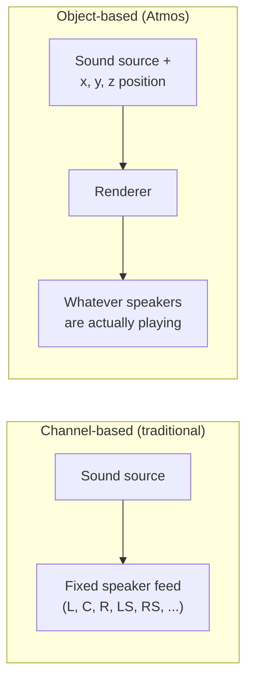
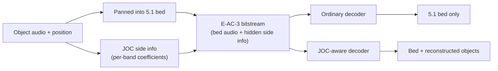

# Atmos & JOC

[Concepts](index.md) introduced Dolby Atmos as E-AC-3 (see [AC-3 & E-AC-3](ac3-eac3.md)) plus
an extra object layer. This page explains what an "object" is, how that layer actually rides
inside an ordinary E-AC-3 stream, and two honest limitations of the technique.

## Channels vs. objects

A traditional, channel-based mix locks each sound to a fixed speaker — or blends it between a
couple of fixed speakers — at the time the mix is made. The mix engineer decides "this sound
goes to left-surround" and it stays there, however many speakers the eventual listener has.

An **object**, instead, is a sound plus a position in 3D space (left/right, front/back,
up/down) — and that position can move over time. The mix carries the sound and its position,
not a decision about which speaker plays it. It's the **decoder/renderer**, at playback time,
that works out how to spread the object across whatever speakers are actually present —
5.1, 7.1.4, a soundbar, headphones — rather than the engineer baking in one fixed layout
months earlier.

## How Atmos actually rides inside E-AC-3

Atmos-in-E-AC-3 is not a second, separate bitstream sitting next to the first. It's one
E-AC-3 stream, built like this:

1. At encode time, each object gets **panned into the ordinary 5.1 bed** — mixed down into the
   same five directional channels plus LFE that a plain E-AC-3 stream would carry anyway. A
   receiver with no idea objects exist just plays that bed and hears a sensible 5.1 mix.
2. In parallel, **JOC** (Joint Object Coding) computes extra per-band "side information" —
   coefficients that describe how each object was panned into the bed, band by band. A
   JOC-aware decoder can use those coefficients to run the panning backwards and pull each
   object's audio back out of the bed.

Both paths produce the same one E-AC-3 bitstream. What a given decoder gets out of it depends
entirely on whether it knows to look for the side information.

## Which domain the matrix lives in

The JOC coefficients are per-band gains, so before anything can apply them, both ends have to
agree on what a "band" is. TS 103 420 answers that in §7.1: the reconstruction runs in a
**64-subband complex QMF** — an oversampled complex filterbank, not the MDCT the codec uses for
its own audio. §6.6.6 is then just a matrix multiply per subband, per timeslot.

That distinction is not decoration. The MDCT is *critically sampled and real*: its subbands only
behave like subbands as long as neighbouring blocks agree on what was done to them, because the
overlap is what cancels the time-domain aliasing each block carries. A JOC matrix is per-band and
changes every frame, so applying it over MDCT bins breaks that cancellation and leaves the residue
in the output. A complex filterbank at 2× oversampling has no such dependency — a per-band gain is
just a gain. It also resolves the matrix ramp four times as finely: 24 timeslots per frame against
the MDCT path's six blocks.

Until this was implemented, this project had no filterbank, and estimated and applied the matrix
over 256 MDCT bins, four to a subband. That is self-consistent between this encoder and this
decoder, and wrong against everything else — a licensed decoder has no such setting and reads
every matrix as a QMF one. Measured head to head, mean per-object SNR over four placements:

| estimated in ↓ / reconstructed in → | MDCT-band | QMF |
|---|---|---|
| **MDCT-band** | 22.8 dB | 23.5 dB |
| **QMF** | 27.7 dB | **28.6 dB** |

Read down the QMF column — the only one a licensed decoder has. The same objects, encoded the old
way, reconstruct at 23.5 dB; encoded in the QMF domain, 28.6 dB. Most of that 5.1 dB is the
*estimate* rather than the reconstruction: an MDCT coefficient's magnitude depends on where the
tone happens to sit relative to the block boundary, so per-band power read off it is noisy in a
way a complex subband's magnitude is not. On moving objects, where the finer ramp also counts,
the same swap is worth 20.2 dB → 26.5 dB.

Both are the default now, encoder and decoder. The MDCT path stays available as
`AtmosConfig::joc_domain` / `DecoderConfig::joc_domain` (`joc-domain=mdct` on the CLI) for
reproducing older output; it is not part of `mode=performance`, because unlike the two transform
switches that flag drives, the two domains are different answers rather than the same answer at
different speed.

One thing changes for callers: reconstructed object audio lags the bed by 576 samples in the QMF
domain rather than 256, which is the filterbank pair's own algorithmic delay (a 640-tap window
less one 64-sample hop) and cannot be shortened. `joc::reconstruction_delay(domain)` is the single
place either number is written down.

The filterbank itself is `ac3::dsp::QmfAnalysis` / `QmfSynthesis`. Its prototype filter is
designed in this tree rather than transcribed: §7.1 fixes the *shape* — 64 subbands, complex,
odd-stacked — and does not publish coefficients. The design is constrained to exact perfect
reconstruction (analysis then synthesis returns the input bit-for-bit at the float boundary), with
the remaining freedom spent on selectivity; `tools/generators/gen_qmf_prototype.py` carries the
derivation.

## OAMD

**OAMD** (Object Audio MetaData) is where the position, size and motion data for each object
actually lives — the "x, y, z position" in the diagram above, per object, per unit of time.
It's the metadata a renderer reads to know where each object should be placed.

An object is more than a point, and OAMD says so: as well as position and gain it carries the
object's **extent** (a width, depth and height, so a sound can be a wall of rain rather than a
raindrop), its **priority** (which objects a renderer short of speakers should place accurately),
**zone constraints** (which parts of the room the renderer may use — screen only, surround only,
with or without the height layer), and **channel lock**, which asks for the object to be snapped
to its nearest speaker instead of panned between two. All of them are read on decode and written
on encode here; see [Spatial & Atmos objects](../library/spatial-and-atmos.md) for the API.

Two things about OAMD are easy to get wrong, and both matter for reading *other people's*
streams rather than your own:

- **A programme need not be objects.** OAMD describes a *bed* just as happily — a fixed
  7.1.4 speaker layout, coded exactly like objects but anchored to speakers. That is what most
  channel-based-immersive Atmos content actually is, and JOC still reconstructs its eleven
  non-LFE channels out of the 5.1 downmix.
- **Metadata updates are not once per frame.** A frame can carry several update blocks, each
  taking effect at its own offset into the frame and each able to code positions as steps
  against the previous one — which is how an object moves faster than one position per 32 ms.

## EMDF

**EMDF** (Extensible Metadata Delivery Format) is the generic, extensible container format
that OAMD and JOC's side information both ride inside. Think of it as an envelope: it's tucked
into parts of the E-AC-3 bitstream — auxiliary data and per-block skip fields — that the
standard requires older decoders to simply skip over, since they don't know what's in them.
That skip behaviour is *how* backward compatibility works: an old decoder ignores the EMDF
envelope entirely and just plays the 5.1 bed underneath, no crash, no confusion, no awareness
that objects were ever there.

## The fallback rule: objects, or nothing

A stream **carries objects or omits the container entirely — never an empty one, and never a
container-less stream that still claims objects.** Both halves matter, because two different
things advertise the object layer and they have to agree:

- The **EMDF container** itself. A decoder that *validates* the container's protection field
  treats its sync word as a commitment to object decoding: if the field doesn't check out it
  refuses the whole stream rather than falling back to the bed. So an empty or unusable
  container is worse than no container — with nothing to find, that decoder plays ordinary 5.1.
  This is what `ac3cli atmos ... bed51` and `AtmosConfig::emit_object_metadata` are for.
- The **`addbsi` object marker** (ETSI TS 103 420 §8.3.1's `flag_ec3_extension_type_a` and
  §8.3.2.2's `complexity_index_type_a`). This is a few bits in the bitstream header, and it is
  the only thing a *reader* — as opposed to a decoder — has to go on: it is what
  `ac3::io::scan` reports, what the MP4 `dec3` box's Dolby Atmos extension is built from, what
  becomes an HLS `CHANNELS="<N>/JOC"` attribute, and what makes FFmpeg report the stream as
  "Dolby Digital Plus + Dolby Atmos". A stream with the marker but no container promises a
  packager, a player and a manifest an object layer that isn't there.

So the marker follows the container: emit both, or neither. The same rule is why an object-layer
strip has to remove both, not just the payload.

## Two honest limitations

Object coding, and this project's implementation of it, have real limits worth stating
plainly rather than glossing over:

**Objects sharing a direction can't be perfectly separated.** JOC reconstructs each object as
a combination of the five bed channels. Two objects at the same direction from the listener
but different heights end up with identical bed gains, so no amount of unmixing can tell them
apart — there is no matrix that pulls them back into two separate signals. Instead, the
reconstruction splits their combined energy between them by power. This isn't a bug in this
encoder; it's an inherent property of parametric object coding — the side information
describes *how much* energy came from where, not a perfect per-object recording, so directly
overlapping objects are approximated rather than perfectly isolated.

**Dolby's own decoder additionally requires an authenticity tag, and that tag needs a key you
provide.** Beyond the spec, a Dolby-licensed decoder gates object decoding on a keyed HMAC carried
in the stream's EMDF protection field. A stream from this encoder is spec-correct — it validates
against independent tooling and the bed decodes correctly — but unless that tag is present and
valid, the licensed decoder falls back to playing just the plain 5.1 bed rather than
reconstructing the objects. This is an authenticity gate, not a correctness or conformance problem.

The signer that produces the tag ships in the tree (`ac3::signing`): the HMAC construction and the
layout of what gets signed are clean-room and committed, and the **only** thing you supply is the
key — provisioned at runtime, never embedded, the same way a licensed tool receives its own. With a
matching key, a validating decoder reconstructs the objects; without one, the stream stays a valid
Atmos-in-E-AC-3 stream that plays as 5.1 on that decoder. See
[Object signing](object-signing.md) for the full picture and how to turn it on.

!!! example "See it in code"
    - [Spatial & Atmos objects](../library/spatial-and-atmos.md)
    - [Object signing](object-signing.md) — the EMDF protection tag and how to provision a key
    - [CLI commands](../cli/commands.md) — see the `atmos` and `atmos-encode` commands
    - [Objects & motion (GUI)](../gui/objects-and-motion.md)

---

Back to [AC-3 & E-AC-3](ac3-eac3.md), or up to the [Concepts overview](index.md).
