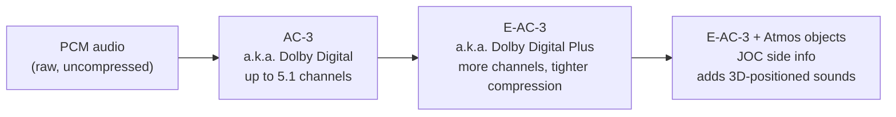

# Concepts

This section explains the ideas behind ac3forge in plain language — no code, no DSP maths,
no prior knowledge of audio codecs assumed. If you have ever seen "Dolby Digital" or "Dolby
Atmos" on a disc case or a TV settings menu and wondered what it actually means, start here.

The rest of the documentation ([Library](../library/index.md), [CLI](../cli/index.md),
[GUI](../gui/index.md)) shows you how ac3forge implements these ideas in software. This
section only explains what the ideas *are*.

## Why compress multichannel audio at all?

A CD track is stereo: two channels of **PCM** (pulse-code modulation — audio stored as a
plain sequence of sample values, with nothing squeezed out) audio. A film or TV soundtrack
usually carries more: six channels for "5.1" surround, eight for "7.1", sometimes more.

Six to eight uncompressed channels is a lot of data — too much to fit comfortably on a DVD,
inside a broadcast signal, or down a streaming pipe alongside the video. Compressed
multichannel audio formats exist to squeeze all of those channels down to a fraction of their
raw size, in a way a decoder can unpack fast enough to play back in real time, so a disc,
broadcast stream, or download can carry full surround sound without needing six to fourteen
uncompressed tracks.

## One family, three names

The formats ac3forge implements form a single lineage, each one building on the last:

- **AC-3** — better known by its trademarked name **Dolby Digital**. The original: a 1990s
  standard for cinema, DVD, and broadcast, supporting up to 5.1 channels (left, centre,
  right, left-surround, right-surround, plus a bass-only LFE channel).
- **E-AC-3** ("Enhanced AC-3") — better known as **Dolby Digital Plus**. Adds more channel
  layouts (7.1 and beyond) and squeezes harder for the same audio quality, so it fits more
  channels into less bitrate.
- **Dolby Atmos** — not a separate audio codec. It is E-AC-3 with an extra layer of
  metadata bolted on, describing sounds as *objects* with a position in 3D space rather than
  as channels locked to fixed speakers. That extra layer travels inside the E-AC-3 stream
  itself, via a side-channel called **JOC** (Joint Object Coding).

Each arrow is additive: E-AC-3 is AC-3 plus more tools, and Atmos is E-AC-3 plus an object
layer riding on top. A plain Dolby Digital decoder that has never heard of Atmos can still
play an Atmos stream — it just plays the ordinary 5.1 mix underneath and ignores the part it
doesn't understand. The [AC-3 & E-AC-3](ac3-eac3.md) page covers the first two links in that
chain; [Atmos & JOC](atmos-joc.md) covers the third.

!!! note "Trademarks and standards"
    "Dolby", "Dolby Digital" and "Dolby Atmos" are trademarks of Dolby Laboratories. ac3forge
    implements the openly published standards behind them — ATSC A/52:2018 (of which E-AC-3
    is normative Annex E), ETSI TS 102 366, and ETSI TS 103 420 — using the technical names
    AC-3 and E-AC-3 throughout its code and docs. It is not affiliated with, endorsed by, or
    certified by Dolby Laboratories.

## Why this project exists

ac3forge is a clean-room implementation: it is built entirely from the published standards
above, not by studying or reusing any existing codec's code. It links no other codec library —
not even to decode. During development, FFmpeg is used only as an independent, external pair
of eyes: encoder output gets checked against FFmpeg's own decoder as a sanity check, but the
project never depends on FFmpeg to build or run. The point is to understand these formats from
first principles, by implementing the standards directly, rather than to wrap or extend
existing tooling.

## Where to go next

- [AC-3 & E-AC-3](ac3-eac3.md) — frames, channel layouts, bitrate, and what E-AC-3 adds over
  plain AC-3.
- [Atmos & JOC](atmos-joc.md) — how object-based audio rides inside an ordinary E-AC-3
  stream, and two honest limitations of object coding.
- [Object signing](object-signing.md) — the keyed EMDF protection tag a licensed decoder checks
  before reconstructing objects, why the algorithm is in-tree but the key isn't, and how to turn
  it on.

Once the formats make sense, [Capabilities](../library/capabilities.md) says which parts of them
this project implements, and the three members that use it are the library itself,
[Forge](../forge/index.md) (`ac3cli` and `ac3gui`) and [Crucible](../crucible/index.md), which
encodes a desktop's own applications as objects in real time.
