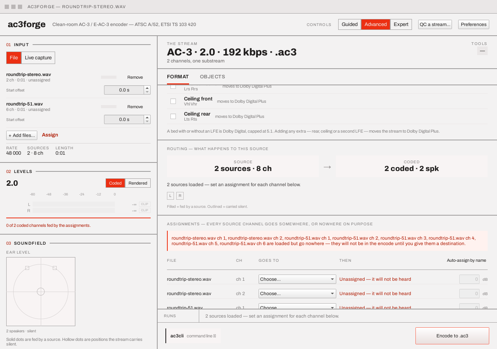

# Multi-source & assignment

Assignment is the model everything else derives from: the meters' fed flags, the soundfield's
solid-versus-hollow dots, the routing sentence and channel map, the object list, and the CLI
line's `map=` tokens all read the one inventory this table edits. It appears in three places —
the full table on the [Format tab](format-and-channels.md#assignments), guided step 1's **What
each sound does** list (the same rows in plain language), and the **Assign** jump on the rail's
[Input block](loading-a-source.md#01-input) — all writing the same state, so there is nothing to
reconcile.

**+ Add files…** loads a second, third, … WAV alongside the primary rather than replacing it. A
source whose rate doesn't match the primary's is resampled to it at load (see [Loading a
source](loading-a-source.md#01-input)) rather than refused, so every source `plan::render`
actually sees always shares one rate regardless of what each file was authored at.

## The source list

One row per loaded file on the rail — label, channel count, duration, a per-source **start
offset** (see [Objects & motion](objects-and-motion.md#motion)), and a **Remove** button.
Removing the primary (the first row) drops every other source and the assignment table with it:
there is no way to guess which remaining source should be promoted to primary in its place.
Removing any other source clears the assignment table instead of trying to shift its rows down —
a row addressed a *position* (source index, channel index), every later source's index just
changed, and guessing which old row survives at its new position is exactly the kind of
silently-maybe-wrong behaviour this table exists to avoid.

[Objects](objects-and-motion.md) does **not** share that problem: an object's authored motion is
keyed to the (source, channel) it actually belongs to, not to its position in the object list, so
removing a non-primary source only drops *that* source's own objects and keyframes — every
surviving source's authored motion stays exactly where it was, and reappears in the object list
the moment its channels are (re)assigned to "an object" again. Reassigning a channel away from
"an object" and back has the same property: its motion is not lost in between.

## Assigning channels

One row per (source, channel) pair — `<file>` · `ch <n>` — with a destination dropdown and a trim
field:

| Choice | Destination |
|---|---|
| **Bed · `<position>`** | One of the coded positions the current plan actually carries (`L`, `C`, `R`, `Ls`, `Rs`, `LFE`, `Lrs`, `Vhl`, …) — the options track the picker, so a position that isn't in the plan isn't on offer. A full-bandwidth channel sent to `LFE`/`LFE2` this way is sent through a 120 Hz low-pass rather than passed through untouched — an explicit assignment states raw content for that position, and a real subwoofer assumes it only ever carries deep bass. A source's own dedicated LFE channel reaching `LFE` through *automatic* single-source routing (nothing assigned at all) is unaffected — it stays bit-exact |
| **A new object** | An Atmos object — choosing this *turns object mode on*, fixes the 5.1 bed and raises the bit rate to at least 384 kbps, atomically (see [Objects & motion](objects-and-motion.md)) |
| **One object, folded to mono** | Offered on either row of a two-channel source: folds BOTH channels into a single mono object — an equal-weight sum of the two, scaled to avoid clipping — instead of two separate objects. Picking anything else on either row breaks the pairing |
| **Programme 1 / Programme 2** | The two programmes of a [`1+1` dual-mono bed](format-and-channels.md#dual-mono) — the only destinations besides **Nothing** offered while 1+1 is selected |
| **Nothing** | Explicitly nowhere — a decision in its own right, which silences the "goes nowhere" warning for this channel |

Each row's right-hand column says what its choice means in plain language (`Carried as a
channel`, `An object, placed in the room`, `Deliberately silent`, `Unassigned — it will not be
heard`). A channel left untouched once more than one source is in play is named in a warning
banner built from the live inventory — `<file> ch <n> … loaded but go nowhere — they will not be
in the encode until you give them a destination` — and the encode is refused until every channel
has an answer, since automatic panning has no defined meaning across several files. Two rows
naming the same location simply sum there (two sources may legitimately feed one speaker); a
location the current bed doesn't carry is rejected the same way the encoder itself would refuse
it.

Each row also carries a **trim** field — a signed dB gain in `[-24, +24]`, `0` by default and
rendered muted at that default — applied as linear gain wherever that channel's content reaches
the stream: folded into the routing matrix for a bed position or a dual-mono programme (so the
meters, the fed flags and the real encode all inherit it for free through the same routing), or
into the object's own plane at assembly for an object/folded-mono destination. The command bar's
`map=` token carries it as `L@-3.5`-style suffix on the destination, so a trim set here is always
reproducible on the command line (see [CLI → Options & grammars](../cli/metadata-options.md)).

With exactly one source loaded and nothing set, the dropdowns read **Automatic** and the rows say
so — the source's channels are panned onto the selected bed by direction, the way a single file
has always been routed — and the table is still there to override any channel individually, or to
send one to an object.

**Auto-assign by name** (in the table header) fills every still-unassigned channel whose source
has a natural AC-3 layout with the position that channel holds in it — a 5.1 file's third WAV
channel *is* its centre, so it goes to `C`; a stereo pair lands on `L` and `R`. Positions the
current plan doesn't carry are left unassigned (and keep their warning) rather than invented, and
a decision already made — explicit positions and deliberate "Nothing"s alike — is never
overwritten.

## Guided round trip

Guided step 1 carries the same rows as **What each sound does**, with a footer link — **Open the
full assignment table →** — that switches to Advanced's Format tab and shows a return strip:
*"You came here from the guided steps. Anything you change is kept when you go back."* The round
trip is lossless because both surfaces edit the same state; **Back to guided** simply switches
the tier back.

## Next

[Format & channels](format-and-channels.md) — the bed and extras every assigned position above
has to match.
