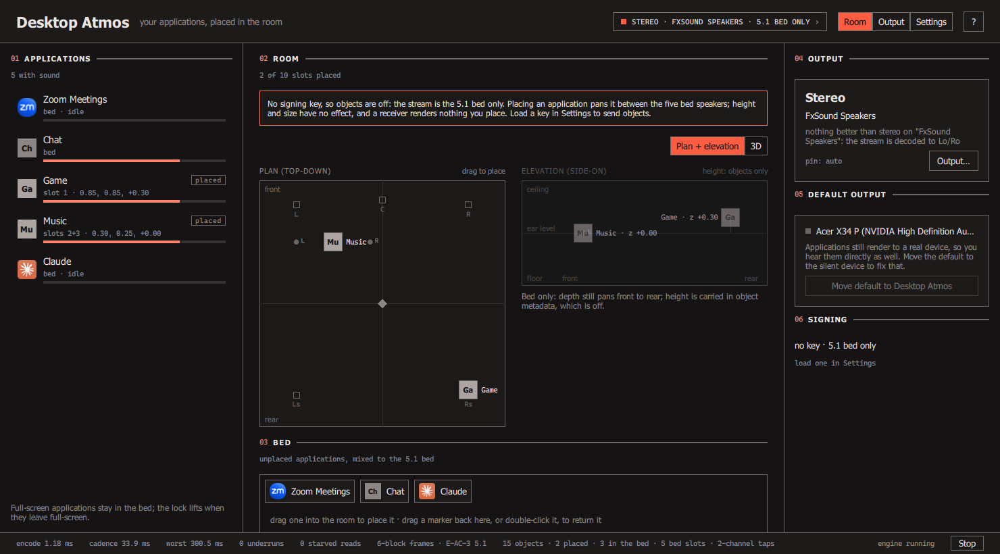
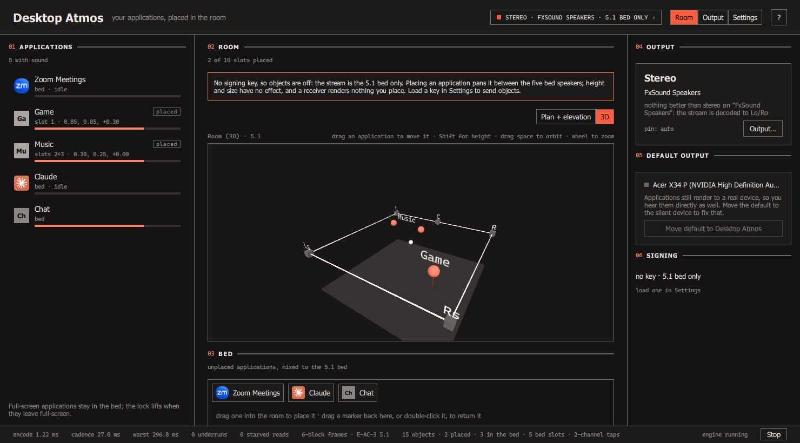
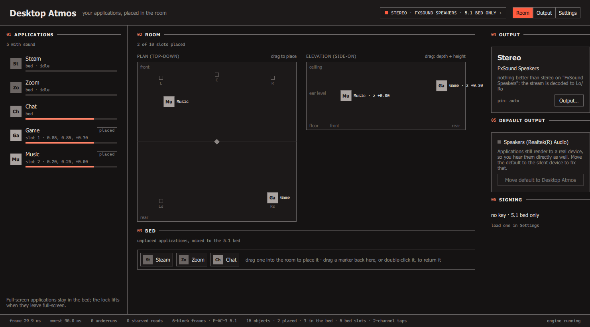
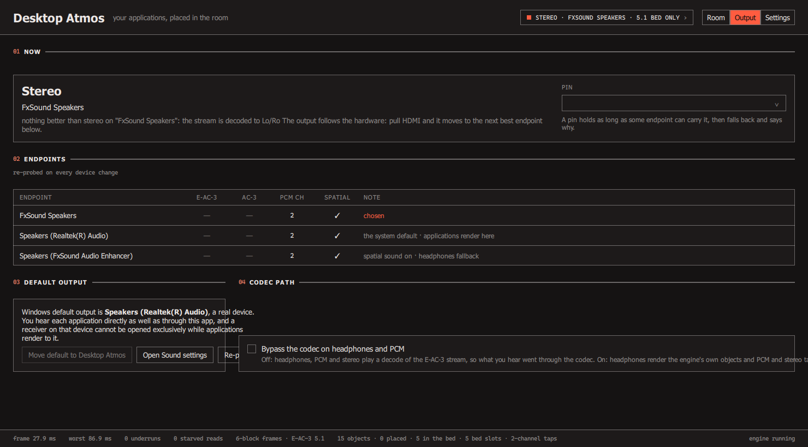
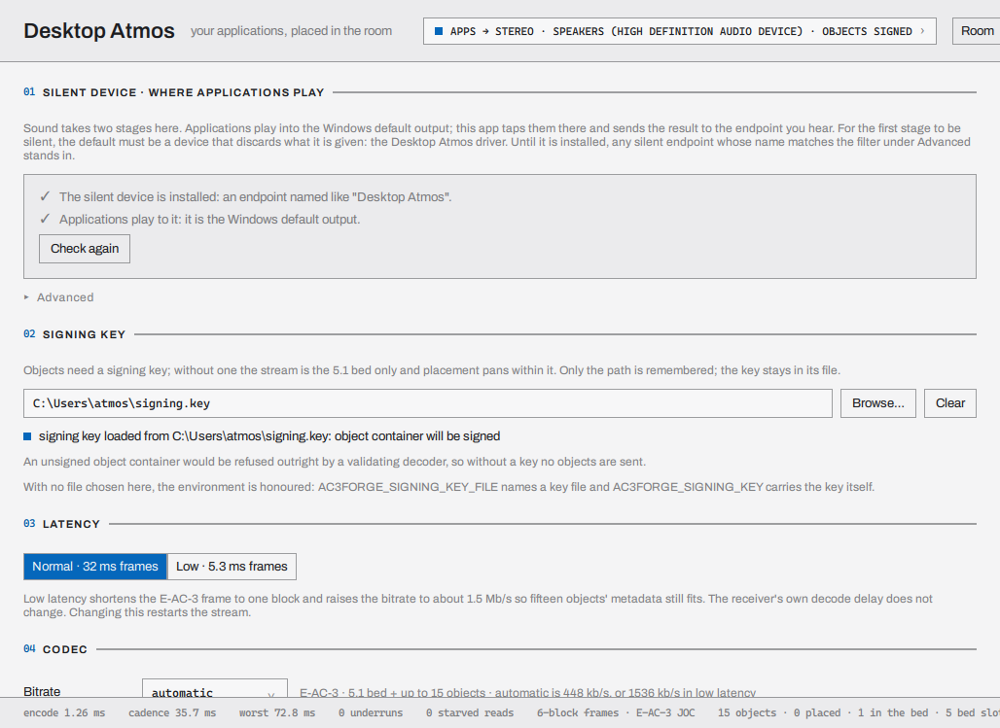
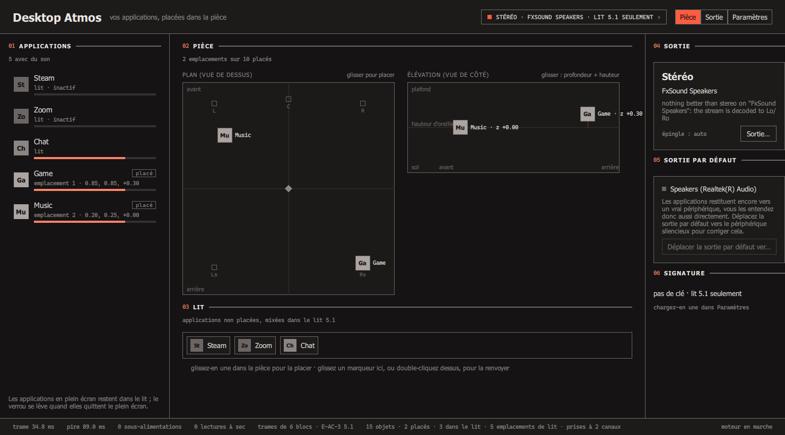

# Windows (Desktop Atmos Demo)

!!! note "Status: built, Phase 6 open"
    Phases 1 to 5 of the plan below landed on 2026-09-03 (roadmap UX11): the library taps and
    watcher, the engine and its console runner, the `ac3desk` window, the null-sink driver
    verified in a throwaway guest, and the fast follows. Phase 6 is open: of its five items,
    this page's rewrite from plan to record, the roadmap record and the CHANGELOG entry are
    done by the documentation pass of 2026-09-03, and CI on the self-hosted Windows runners
    and attestation signing remain. The page keeps the shape of
    [the Android page](android.md): the design sections say what the app does, each phase
    carries its progress record, and the
    [verification section](#what-has-and-has-not-been-verified) says what has been checked on
    real hardware and what has not.

The Windows demo is a different animal from the Shield app. The Shield app plays one authored
stream and lets a controller move one object. The Windows app, **Desktop Atmos Demo**
(`apps/windows/`, working name), installs itself as the PC's output device the way FxSound does,
takes every application that is playing sound, and lets the user drag each one to a position in
the room. What comes out over HDMI is a live E-AC-3 JOC (Atmos) stream in which each application
is an object at the position it was dragged to. Chrome playing a video can be put up and behind
the seat, a game in the corner, a chat client at the left ear, and an AV receiver renders exactly
that. A full-screen application becomes the bed.

It is a joke app in the sense that nobody needs their spreadsheet to be overhead. It is a serious
demo in the sense that it exercises, live and in real time, the parts of the library the Shield
app does not: per-application capture, a dynamic object count, a headphone path, output
hot-switching, and the Windows exclusive-mode bitstream path that
[roadmap DR9](../roadmap.md) still lists as unconfirmed on real hardware.

## The user story

1. Install the app. Optionally install its virtual audio device, "Desktop Atmos Speakers".
2. Pick "Desktop Atmos Speakers" as the Windows default output, or let the app do it with one
   click. Every application now renders into a device that nobody hears.
3. The app's room view shows an icon for every application that is currently making sound,
   pulled from the same session list the Windows Volume Mixer uses. New applications appear
   when they start playing; they leave when they stop.
4. Drag an icon anywhere in the room, in plan and in elevation. That application is now a
   dynamic object at that position. Drag it back to the centre tray, or press reset, and it
   returns to the bed.
5. Whatever the app is not told to position, and whichever application is full-screen in the
   foreground, is mixed into the 5.1 bed.
6. The output follows the hardware. An Atmos-capable receiver over HDMI gets E-AC-3 JOC with the
   objects intact. A Dolby Digital receiver gets AC-3 5.1 with the positions panned onto the
   ring. A TV or PCM-only sink gets decoded multichannel PCM. Headphones get the decoded objects
   through Windows Spatial Sound. Plugging or unplugging HDMI switches modes without a restart.
7. Minimise it and it lives in the tray.

## What's reused, what's new

The point of writing this down first is that almost the whole pipeline exists. The table is the
inventory the plan is built on, with the header each item lives in.

| Piece | Status | Where |
|---|---|---|
| E-AC-3 JOC encoder, 5.1 bed plus up to 15 dynamic objects, count fixed at construction | exists | `ac3::oba::AtmosEncoder`, `src/forge/include/ac3/oba/atmos.hpp` |
| Live per-object placement surface the UI pushes into once per frame | exists | `ac3::oba::SceneCursor`, `src/forge/include/ac3/oba/scene.hpp`; the three-call pattern is `examples/osc_object_control.cpp` |
| 5.1 bed panner for the AC-3-only receiver case | exists | `ac3::spatial::BedRenderer`, shown in `examples/spatial_objects.cpp` |
| IEC 61937 burst framing for AC-3 and E-AC-3 | exists | `ac3::iec61937`, `src/forge/include/ac3/iec61937/iec61937.hpp` |
| Exclusive-mode HDMI/S/PDIF bitstream sink, with a per-device format probe | exists, unconfirmed on a real receiver on Windows | `ac3::audio::PassthroughSink`, `enumerate_render_devices()`, `src/audio/include/ac3/audio/passthrough.hpp` |
| Shared-mode multichannel PCM sink | exists | `ac3::audio::MonitorSink`, `monitor.hpp` |
| Windows Spatial Sound object sink (headphones) | exists, confirmed against a real spatial endpoint | `ac3::audio::SpatialObjectSink`, `spatial.hpp` |
| Whole-endpoint WASAPI loopback capture | exists | `ac3::audio::Capture` with `DeviceKind::kLoopback`, `src/audio/src/backend/windows/capture.cpp` |
| Decoder with §7.8 downmix for the honest headphone path | exists | `ac3::OutputStage`, `src/forge/include/ac3/decoder/output.hpp` |
| Object signing hook pattern | exists, on Android | `apps/android/app/src/main/cpp/shield_signing_hook.hpp` |
| Draggable room widget, plan plus elevation | exists, in the GUI's Live tab | `apps/gui/qml/Main.qml` (`liveRoom`), `SoundfieldView.qml` |
| Reference live encode loop | exists, twice | `apps/cli/commands/live_audio.cpp` (`run_live`), `apps/android/.../live_cursor.cpp` |
| **Per-process loopback capture** | **landed** (Phase 1) | `Capture::start_process_loopback`, Windows backend only, see [Library additions](#library-additions) |
| **Render-device arrival and removal notifications** | **landed** (Phase 1) | `ac3::audio::DeviceWatcher`, Windows backend only |
| **Audio session enumeration** (who is playing, PID, name, icon) | **new, app-level** | `apps/windows/` |
| **Virtual null-sink audio device** | **new, separate driver project** | `apps/windows/driver/` |
| **Output-mode state machine with hot switching** | **new, app-level** | `apps/windows/` |
| **Low-latency mode** | **new, configuration of existing knobs** | `AtmosConfig::numblkscod`, capture buffer size |
| Tray-resident Qt Quick UI | new | `apps/windows/` |

Nothing in `src/forge/` changes. The library additions are two Windows-backend files and their
`kNoBackend` twins in every other backend, per the
[platform-tree convention](raspberry-pi.md#why-theres-no-raspberry-pi-specific-code).

## Routing: two problems, not one

"Register as an output device and see every application's audio separately" is two separate
problems on Windows, and it helps to keep them apart because they have different solutions.

**Separation** is solved without a driver. Windows 11 (build 20348 and later) has process
loopback capture: `ActivateAudioInterfaceAsync` with
`AUDIOCLIENT_ACTIVATION_TYPE_PROCESS_LOOPBACK` opens a capture stream that carries only what one
process tree renders. One client per application, each on its own thread, each delivering that
application's contribution to the mix in the endpoint's mix format. The Volume Mixer's session
list (`IAudioSessionManager2` and friends) tells the app who is playing, with process ID,
display name and icon, and raises a notification when a session appears or changes state.
Granularity is the application, not the browser tab: Chrome renders all tabs from one utility
process.

**Silencing** is the problem the driver solves. If the app taps Chrome and re-emits it over
HDMI, Chrome also still plays out of whatever the default device is. Muting the session in the
mixer mutes the tap as well, because the tap sits after session volume in the engine (S1
confirmed it: the tap went silent within a second of the mute). Opening the default endpoint
in exclusive mode while other applications are rendering to it is worse than useless: S1 found
the open is refused with `AUDCLNT_E_DEVICE_IN_USE` and the applications' streams are invalidated
anyway, so they stop playing and the taps deliver silence from then on. The clean
answer is the one FxSound arrived at: a **virtual render endpoint that discards what it is
given**. Make it the system default and every application renders into a device nobody hears,
while the per-process taps pick each one off individually. The driver has no smarts at all. It
is a null sink whose only job is to exist and to advertise a format.

That format is the second thing the driver buys. It advertises **7.1 at 48 kHz**, so a game
that can render surround does, and its tap arrives as eight channels that drop straight into the
bed. Without the driver the taps arrive in whatever the user's real default device offers,
usually stereo.

### The driver-free mode

The app must work, in a degraded way, with no driver installed, because driver installation
is the highest-friction step and because CI will not have one. Driver-free mode means:

- the user picks any endpoint they cannot hear as the default (a monitor with no speakers, an
  idle virtual cable, a muted device), or accepts hearing the direct mix as well;
- taps still work, positions still work, every output mode still works;
- the app says plainly, in the UI, why the direct mix is still audible and what fixes it.

FxSound is installed on the development workstation. Its endpoint, "Speakers (FxSound Audio
Enhancer)", is a production-signed virtual render device that goes nowhere when the FxSound
application is not running. It is the development stand-in for our own driver until Phase 4.
S1 used it to prove the whole model: applications rendering to it were tapped identically to
applications on the real default, and with them there the workstation's Realtek endpoint could
be taken in exclusive mode (`S_OK`) without the taps noticing.

### Rerouting: explicit, like FxSound

The undocumented per-application routing interface that EarTrumpet uses
(`IAudioPolicyConfigFactory::SetPersistedDefaultAudioEndpoint`) is deliberately **not** used.
The app changes the system default output, with a confirmation, and restores the previous
default on exit. Windows has no documented API for that either: the route every
default-switcher utility takes is the well-known `IPolicyConfig::SetDefaultEndpoint`, stable
since Vista and used by FxSound, SoundSwitch and EarTrumpet alike. It is still unsupported, so
the app treats it as a convenience with a fallback: if the call is refused, it opens the Sound
settings page and asks the user to pick the device, and detects the change through the
`DeviceWatcher`. Per-application rerouting would let the app work alongside a normal default
device, but it is a second, less-travelled undocumented surface, and it is not what FxSound
does. It stays on the list as a possible later phase.

## Objects and the bed

The encoder's object count is fixed when it is constructed, so the app allocates **all 15
dynamic slots at start** and feeds silence to the idle ones, the same way the Shield app keeps
three objects alive for every scene. An application being dragged out of the bed takes the
lowest free slot; dragging it back frees the slot. Nothing is ever rebuilt mid-stream.

**The bed is five of those slots.** `AtmosEncoder` has no bed input of its own: its 5.1 bed is
rendered *from* the objects, and it knows nothing of OAMD's bed labels (those live in
`SceneObject::bed` for authoring and reach the wire, but the encoder's `ObjectPlacement` has
no such field). So the demo's bed is five objects pinned to the L, R, C, Ls and Rs speaker
positions with `snap` set, plus `lfe_send` for the LFE, and the bed mixer sums bed applications
into those five. That leaves **10 slots for positioned applications**, not 15. It is still
more than a desk needs, and it is honest about what the encoder does.

**Mono per application** is the default. Each tap's channels are folded to one signal
(a plain L+R sum for a stereo render; the §7.8 fold for a surround render) before it goes into
its slot. That gives up to 10 positioned applications alongside the five-slot bed.
The stretch, as a per-application user choice, is **split**: a stereo render becomes two
objects placed either side of the application's position, and a surround render becomes a
cluster. Split costs slots, so the slot allocator refuses when the budget would be exceeded and
the UI says so.

**What goes to the bed:**

- every application the user has not positioned;
- the foreground full-screen application, always, even if it was positioned, because a
  full-screen game that renders 7.1 is the bed. The UI shows why its icon snapped back.

Bed applications are mixed by the app, not by Windows, because the taps are per process and
there is no "everything except these" tap (the exclude mode takes one process tree, not a
list). A stereo bed application goes to the L and R bed slots; a 5.1 render maps one-to-one
onto the five plus the LFE send; a 7.1 render folds the side and rear pairs into Ls and Rs.
Total bed contributors are unbounded; total taps are one per playing session, and S1 ran
sixteen at once without strain.

Positions use the library's room coordinates (`ac3::oba::Position`): `x` from 0 at the left
wall to 1 at the right, `y` from 0 at the front wall to 1 at the back, `z` from -1 at the floor
to +1 at the ceiling. The seat is at the centre. The UI's plan view sets `x` and `y`; the
elevation view sets `z`. Moves are pushed through `SceneCursor::push()` once per frame, and a
drag is smoothed across a few frames because a 32 ms step in position is a click.

## Output modes and hot switching

| Mode | Chosen when | What positions become | What the sink is |
|---|---|---|---|
| **Atmos** (E-AC-3 JOC) | a render endpoint accepts E-AC-3 in exclusive mode and a signing key is present | objects, intact | `PassthroughSink`, E-AC-3 bursts |
| **DD+ 5.1** (E-AC-3, no object metadata) | as above, no signing key | panned onto the bed by `BedRenderer` | `PassthroughSink`, E-AC-3 bursts |
| **DD 5.1** (AC-3) | an endpoint accepts AC-3 but not E-AC-3 | panned onto the bed | `PassthroughSink`, AC-3 bursts |
| **PCM surround** | an endpoint offers 6 or 8 shared-mode channels and no bitstream format | encoded, then decoded and rendered | `MonitorSink`, 5.1 or 7.1 |
| **Headphones** | the default endpoint has a spatial format enabled (Windows Sonic, Dolby Atmos for Headphones, DTS Headphone:X) | encoded, then decoded, objects handed to the OS renderer at their OAMD positions | `SpatialObjectSink` |
| **Stereo** | nothing above applies | encoded, then decoded, Lo/Ro fold | `MonitorSink`, 2 channels |

Detection on Windows is a live probe, not an EDID read: `enumerate_render_devices()` asks each
endpoint whether it accepts AC-3 and E-AC-3 exclusive formats and how many shared-mode channels
it has, and `probe_spatial_capability()` asks whether a spatial format is on. Windows does not
expose EDID short audio descriptors to user mode, so `read_sink_capabilities()` keeps returning
`kNoBackend` there and the demo does not pretend otherwise.

Hot switching is driven by the new render-device notifications (`IMMNotificationClient`
underneath): a device arriving or leaving, or the default changing, re-runs the probe and, if
the best mode changed, fades the current sink down over one frame, stops it, starts the next,
and fades up. The encoder keeps running through the switch; only the sink changes. The user can
pin a mode to stop the app changing its mind.

One rule the output stage must hold, from S1: **the probe is safe, the open is not.**
`IsFormatSupported` in exclusive mode can be asked of any endpoint at any time, live streams or
not. `Initialize` in exclusive mode on an endpoint that other applications are rendering to is
refused and still invalidates their streams. So the app takes HDMI exclusively only after the
default has been moved to the null sink and the session list confirms nothing is left on HDMI.

**The headphone and PCM paths decode what was encoded.** It would be less work and lower latency
to hand the taps' PCM and positions straight to the spatial sink, but then those modes would
never exercise the codec, and the demo would be making a claim about the encoder it cannot back.
A codec-bypass switch on the Output page exists precisely so the difference can be
demonstrated.

### Low-latency mode

The normal chain will sit somewhere around 150 to 200 ms behind the picture once a receiver has
decoded it, which is a visible lip-sync error on a video. That is accepted for the joke, but a
user-selectable **low-latency mode** trades the following, all existing knobs:

| Knob | Normal | Low latency |
|---|---|---|
| E-AC-3 frame (`AtmosConfig::numblkscod`) | 6 blocks, 32 ms | 1 block, 5.3 ms |
| Capture buffer | 20 ms | 10 ms or the engine minimum |
| Sink pre-roll | two frames | one frame |
| Bitrate | 448 kb/s | about 1.5 Mb/s, because 15 objects' metadata has to fit every 5.3 ms (S4 found 640 kb/s refused at 1 block, 1536 kb/s fine) |

The encoder's own object latency (832 samples in the QMF domain, about 17 ms) and the
receiver's decode delay do not move. S4 showed the encoder itself is not the constraint in
either mode. Phase 5 measures both chains end to end with a loopback capture and writes the
numbers here; what is measured so far is the engine's own cadence on the workstation
(2026-09-03, stereo decoded mode on the Realtek endpoint, taps on two idle applications,
fifteen seconds each):

| | Normal | Low latency |
|---|---|---|
| Frames in 15 s | 464 (32.3 ms cadence) | 2792 (5.37 ms cadence) |
| Worst frame | 86.9 ms, at start-up | 84.7 ms, at start-up |
| Starved tap reads / sink underruns | 0 / 0 | 0 / 0 |

The one-block frame holds its cadence with the same zero-underrun margin as the six-block
one; the start-up worst case is the first frame's device opens.

**End to end, measured (2026-09-03, spike S5).** `apps/windows/spikes/s5_latency` renders
5 ms tone bursts on a pseudo-random schedule into the null sink from its own process, taps
the runner's output by process loopback, and times both on the QPC clock (`IAudioClock` on the
render side, the capture packet position on the tap side); `Measure-Latency.ps1` runs the
four configurations. Workstation, FxSound's idle endpoint as the null sink, stereo decoded
on the Realtek endpoint, 20 s and 77 bursts each:

| Configuration | Measured, tap to tap | Less the measuring tap | Sink queue |
|---|---|---|---|
| Normal frames, codec in the loop | 127 ms (sd 0.0) | about 108 ms | 32 ms |
| Normal frames, bypass | 128 ms (sd 1.2) | about 109 ms | 36 ms |
| Low latency, codec in the loop | 110 ms (sd 4.8) | about 91 ms | 12 ms |
| Low latency, bypass | 110 ms (sd 3.5) | about 91 ms | 22 ms |

The spike tapping itself, with no engine in between, measures the render-to-loopback path
alone: 15 ms on the FxSound endpoint and 19 ms on Realtek, jitter-free. The "less the
measuring tap" column subtracts the latter; what remains is the engine's own tap delivery
(the same 15 ms, set by the OS), the frame, the decoder's one-unit hold-back in the codec
rows, the sink's queue, and the shared-mode render engine.

Two things the measurement changed in the engine. The taps are flushed when the output
starts or switches: what they gathered while a sink was opening otherwise sat in the sink's
one-second queue for the rest of the session, and the first runs showed both modes at 125 ms
for that reason. And the sink's queue is bounded (two frames, never under 30 ms) with a
catch-up that drops tap audio down to half the bound in one step; the status line carries the
tap backlog, the sink queue and the catch-up count. The low-latency rows still show a few
catch-ups per 20 s: the tap is paced by the null sink's clock and the sink by the Realtek
endpoint's, and a one-block frame leaves little room between them. The remaining gap between
the two modes is smaller than the frame arithmetic promised because the floor is the two
process-loopback deliveries and the render engine, not the frame; the AVR row, when S2 runs,
adds the receiver's decode on top of the codec rows.

Where the rest can and cannot go. The encoder is not on the path: it takes 1 to 2 ms of a
frame, and making it faster changes nothing measurable. Two of the terms are structural:
the process-loopback delivery (about 15 ms, the OS's) and the frame itself (already one
block in low-latency mode). One term looked movable and is not: reading the null-sink
driver's own buffer instead of tapping processes would save the loopback delivery, but the
audio engine mixes every application before anything reaches the driver, so that buffer
holds the desktop's mix and cannot feed per-application placement; the taps are the price of
the objects. The terms that do move are the sink's queue bound (two frames today, one is
possible with the encode headroom S4 measured) and the render period: the monitor sink asks
the audio engine for its smallest shared-mode period in low-latency mode (IAudioClient3,
falling back to the default period where the engine refuses the format at that size).

That second lever turned out to have no travel on this machine. `period_probe`, beside the
spike, asks the endpoint what the engine offers: on the Realtek endpoint
`GetSharedModeEnginePeriod` answers 480 frames for default, fundamental, minimum and maximum
alike, 10 ms, with a 22 ms buffer, for the demo's float format and for the mix format both.
`IAudioClient`'s "minimum 3 ms" is the exclusive-mode floor, not a shared-mode offer. The
library keeps the path (a device that offers 2.7 ms will use it, and the fallback is the old
behaviour), but the workstation's figures do not move for it. What remains on this endpoint
is exclusive-mode PCM output, which the demo's configuration allows (S1 showed the Realtek
endpoint can be taken exclusively while applications render into the null sink) and which
would replace the 10 ms period and 22 ms buffer with the 3 ms the driver allows; that is a
new sink in the library rather than a flag, and the next step if the figure matters.

The queue bound was tried at one frame too. It bought nothing: the sink's queue holds the
frame just submitted while the sink drains it, so its depth of about one frame is the
pipeline's shape, not the bound's doing, and a one-frame bound was crossed at every submit
and dropped audio twice a second. It is back at two. What the runs do show is a spread of
about 15 ms between otherwise identical runs, which is the phase of the sink's 22 ms buffer
and the tap's packets against the frame clock; the table's figures are one run each.

None of the PCM-side terms exist on the demo's real target. The AVR path leaves through the
exclusive-mode bitstream sink, with no shared-mode period, no engine buffer and no PCM
queue: its latency is the tap delivery, the frame, the burst and the receiver's decode, and
the receiver's decode is the one term that stays unknown until S2 runs.

## Object signing

The rule is the Shield app's, unchanged, and the reasons are in
[Object signing](../concepts/object-signing.md): an unsigned-but-present object container is a
hard refusal on a validating decoder, not a graceful fallback, so **with no key the app sets
`emit_object_metadata = false` and streams plain 5.1**. The mode table above shows this as the
difference between the Atmos and DD+ 5.1 rows.

On the desktop the key is resolved **at runtime**, from an explicit path in settings or the
same environment variables `ac3cli` reads (`AC3FORGE_SIGNING_KEY_FILE`, `AC3FORGE_SIGNING_KEY`),
never from a file next to the executable and never
from an installer. Nothing about the build changes with or without a key. The release job's
"no key in the package" assertion carries over from Android to whatever packages this app.

The user supplies the key once and the app remembers it across runs. What the settings store
persists is the **path** to the key file by default; optionally the key bytes themselves,
protected with DPAPI so only the same Windows user on the same machine can read them back,
for a user who would rather not keep a key file lying around. Plaintext key material never
lands in a settings file, a log, or a crash dump, and the settings screen shows only whether a
key is loaded and where it came from. Changing or clearing the key restarts the encoder,
because objects-or-nothing is decided at construction.

## UI

Qt Quick, module `Ac3ForgeDesk` (working name), sharing `Theme.qml` and the room widgets with
the GUI rather than copying them. Screens:

- **Room**: plan view and elevation view side by side, the same layout as the GUI's Live tab and
  the Shield dashboard. Every playing application is an icon with a level ring. Unpositioned
  icons sit in a tray at the bottom labelled "bed"; drag one in to position it, drag it back or
  right-click reset to return it. The foreground full-screen application shows with a lock.
- **Output**: what mode is active, which endpoint, why (the probe result in one line each), and
  a pin. The default-device switch lives here with its confirmation.
- **Settings**: six blocks, whose keys are `DeskController`'s in
  `apps/windows/ui/desk_controller.cpp`. Latency (normal or low-latency frames,
  `codec/lowLatency`). Codec (the bitrate, `codec/bitrate`, and the split-stereo default for
  applications the engine meets from now on, `codec/splitStereo`). Signing key (the key
  file's path, `signing/keyPath`; the `AC3FORGE_SIGNING_KEY_FILE` and `AC3FORGE_SIGNING_KEY`
  variables are honoured when none is chosen). Virtual output device (what the kernel reports
  about test signing and memory integrity, the driver folder, `driver/dir`, with the install,
  remove and re-check buttons that run `install.ps1` and `remove.ps1` elevated, and the
  silent device's name, `output/nullSinkName`). Appearance (theme, `appearance/theme`;
  palette, `appearance/palette`; the room view, `appearance/roomView`; and the language
  chooser, which is the GUI's `LanguageManager` on this app's translations, `language/code`,
  with `AC3GUI_LOCALE` as the test override). Behaviour (move the default output to the
  silent device on launch, `behaviour/moveDefaultOnLaunch`, and keep running in the tray when
  the window is closed, `behaviour/keepRunningWhenClosed`). The codec-bypass switch is on the
  Output page (`bypassCheck`, `codec/bypass`), beside the mode pin, not here.
- **Tray**: minimise to tray, tray menu with output mode, pin, and quit. Closing the window
  keeps the engine running; quitting restores the previous default device.

The 3D room view (Qt Quick 3D, app icons floating in a wireframe room) is a fast follow after
the 2D views work, not part of the first cut.

## Structure

```
apps/windows/
  CMakeLists.txt                  in-tree, behind option(AC3FORGE_BUILD_WINDEMO) and if(WIN32)
  engine/                         headless, namespace ac3::windemo, no Qt
    slots.{hpp,cpp}               the plan: 10 positioned + 5 bed slots, full-screen rule   [landed]
    bed_mixer.{hpp,cpp}           stereo/5.1/7.1 taps -> mono object or the 5 bed slots      [landed]
    placement.{hpp,cpp}           UI targets -> per-frame ObjectPlacement, smoothed          [landed]
    output_policy.{hpp,cpp}       probe facts + pin -> mode, endpoint, reason (the S1 rule)  [landed]
    audio_devices.hpp             the AudioDevices seam: endpoints, sinks and taps as interfaces [landed]
    tap_pool.{hpp,cpp}            one Capture::start_process_loopback per application  [landed]
    output_stage.{hpp,cpp}        probe, policy, sink ownership, the five routes        [landed]
    signing_hook.{hpp,cpp}        runtime key resolution, the Shield rule               [landed]
    engine.{hpp,cpp}              the frame loop and the UI's command/status surface    [landed]
    platform/windows/             the half that talks to Windows, this directory only
      session_monitor             IAudioSessionManager2 -> applications by process tree [landed]
      default_device              read/move/restore the default output (IPolicyConfig) [landed]
      foreground                  SHQueryUserNotificationState + foreground window      [landed]
      wasapi_devices.cpp          the production AudioDevices over the library's WASAPI classes [landed]
      driver_tools.{hpp,cpp}      code-integrity state, the driver folder, elevated install/remove [landed]
  runner/main.cpp                 ac3windemo, the console runner (Phase 2's exit)       [landed]
  ui/                             ac3desk: main.cpp, desk_controller, qml/ (module Ac3ForgeDesk) [landed]
    qml/shared/                   generated at configure time from apps/gui/qml, git-ignored
    tests/                        ac3desk_qmltests: five Qt Quick Test suites, ctest label desk [landed]
  translations/                   ac3desk_{fr,de,es,ar,he,yi}.ts, the GUI's language set    [landed]
  spikes/                         Phase 0 programs, kept as documented experiments
  driver/                         the null-sink driver, separately licensed (see below)
  driver-vm/                      the throwaway VMware guest: create, test and verify scripts
tests/windemo/                    Catch2, on every CI leg, ungated: the four pure modules, and the
                                  tap pool and output stage over the fakes (fake_devices.hpp,
                                  wasapi_devices_stub.cpp)
```

The pure modules, and the tap pool and output stage over the `AudioDevices` fakes, compile
into `ac3tests` on every platform, the way `apps/common` does, so the rules the UI hangs on
(the slot budget, what a full-screen application does, which output wins when) hold on a
Linux CI leg that could never run the demo. The `platform/windows/` half builds only under
the option.

The library gains, in `src/audio`:

- **`Capture::start_process_loopback(pid, mode, format)`**, implemented in
  `src/audio/src/backend/windows/capture.cpp` with the activation-params route, sharing the
  capture thread with the endpoint paths; every other backend refuses it with `kNoBackend` or
  `kProcessLoopbackUnavailable`, and `process_loopback_available()` answers for the machine
  rather than the build. **Landed 2026-09-03.**
- **`DeviceWatcher`** (`ac3/audio/device_watcher.hpp`), a new backend file in every
  directory, delivering default-changed, added, removed and state-changed events on a
  caller-supplied callback; non-Windows backends return `kNoBackend`. **Landed 2026-09-03.**
- Both are reported by `audio_backend()` as `process_loopback` and `device_watch`, and the
  backend contract test exercises both without touching a device (the watcher is actually
  started and stopped wherever the backend exists, since registering needs no endpoint).

Session enumeration, default-device switching and the foreground check are **app-level**, under
`apps/windows/engine/`, because they are demo policy rather than audio I/O and because one of
them touches policy-config COM interfaces that have no business in the library.

Android wraps the repo root from its own Gradle build because Gradle owns that build. Here the
toolchain is the same one the CLI and GUI use, so the demo is an in-tree option like the GUI,
defaulting OFF, with the same pre-seeded `OFF` list for the targets it does not need.

### The driver, and its licence

`apps/windows/driver/` is derived from Microsoft's Simple Audio Sample virtual audio driver
(the smaller sibling of SysVAD, same WaveRT machinery), cut down to one render endpoint that
discards its input and advertises 7.1 at 48 kHz. The sample is licensed
under the Microsoft Public License, which the FSF lists as free but **not GPL-compatible**. That
is fine here because the driver is a separate work: a kernel-mode binary that shares no code
with the GPL-3.0-or-later application and is only ever reached through public Windows APIs.
The `driver/` subtree carries its own `LICENSE` (MS-PL, plus the project's modifications under
the same terms) and its own `README` saying so, and nothing in it is `#include`d, linked, or
copied anywhere else in the repository. FxSound's driver is AGPL and is not used or consulted.

Signing has two stages, in order. First, **test-signed on the development workstation** with
test-signing mode on and memory integrity off, installed with `pnputil`. Second, an EV
code-signing certificate and a Partner Center account for **attestation signing**, so the
driver loads on other people's machines with memory integrity on. The second stage gates the
driver's presence in any published package; until then the package ships without it and the
docs explain how to build and test-sign it locally.

## Phases

Each phase ends with something that runs, and each has a written exit criterion. Prerequisites
that are the developer's to-do rather than code are listed where they bite.

### Phase 0: spikes

Throwaway console programs in `apps/windows/spikes/`, each answering one question, each
leaving its answer in this page. None of it is reused as code.

| Spike | Question | Exit |
|---|---|---|
| **S1 taps** | Does process loopback work against N processes at once, what format arrives, does it keep delivering when the session is muted, when the app is routed to the FxSound endpoint, and when the default endpoint is held exclusively by us? | **Done 2026-09-03**, results in `apps/windows/spikes/README.md`: 16 taps separate exactly at 48 kHz float, mute kills a tap, the FxSound null-sink model works, exclusive on another endpoint is fine, exclusive on the apps' own endpoint is refused and destructive, the probe alone is harmless |
| **S2 bitstream** | Does `PassthroughSink` in E-AC-3 and AC-3 exclusive mode lock on a real Atmos receiver from this workstation? This is DR9's Windows row. | the receiver's front panel reads DD+ Atmos, then DD, at zero underruns for a minute |
| **S3 headphones** | With Windows Sonic enabled on the Realtek endpoint, does encode then decode then `SpatialObjectSink` produce audible height and rear movement by ear? | yes or no, and the measured round-trip latency |
| **S4 throughput** | Does a 15-object `AtmosEncoder` plus 16 taps plus the bed mix hold 32 ms cadence on this machine with margin? | **Done 2026-09-03**, results in `apps/windows/spikes/README.md`: p99 1.8 ms of the 32 ms budget in normal mode; the 1-block frame p99 0.7 ms of 5.3 ms, but needs at least about 1.5 Mb/s to carry 15 objects' metadata (640 kb/s is refused) |
| **S5 latency** | End to end, application to output, how far behind is each mode, and how much of it is the codec? Run under Phase 5, kept here with the others (`s5_latency.cpp`, `period_probe.cpp`, `Measure-Latency.ps1`) | **Done 2026-09-03**, results in `apps/windows/spikes/README.md` and under [Low-latency mode](#low-latency-mode): normal frames about 127 ms and low-latency about 110 ms tap to tap, of which 19 ms is the measuring tap itself; `period_probe` found the Realtek endpoint offers only a 10 ms shared-mode period, so the low-latency render period has no travel there |

Prerequisites: a long HDMI cable to the receiver (S2, the developer's to-do); Windows Sonic
enabled on the headphone endpoint (S3). S3 and S4 do not wait for S2.

### Phase 1: library additions

The process-loopback capture entry point and the device watcher, both in the Windows backend
with `kNoBackend` twins elsewhere, the device-free logic (parameter validation, refusal paths,
watcher lifecycle) covered by the unconditional backend contract test rather than a new
`tests/backend/windows/` directory, and `docs/platforms/windows.md` updated. Exit: a program
tapping one process through the library and reading the tone back. **Done 2026-09-03**:
`s1_library_tap` in the spikes tree reads the spawned player's tone through
`start_process_loopback` at the expected level and frequency, refuses a process id nobody
owns, and starts and stops a `DeviceWatcher`.

### Phase 2: engine

`apps/windows/engine/`, headless. Session monitor, tap pool, slot allocator, bed mixer,
placement, output stage with the mode state machine, signing hook, and the frame loop modelled
on `run_live`. Everything that does not touch Windows is unit-tested on CTest; everything that
does is behind an interface the tests can fake. Exit: a console runner that takes positions on
stdin, streams Atmos to the receiver, and switches to headphones when HDMI is pulled.

**Progress, 2026-09-03:** the pure half landed first, with its tests (36 cases at the time,
every platform; the same four modules hold 42 today): the slot plan with the full-screen rule
and a waiting list for the eleventh application, the bed mixer and mono fold with the channel
maps above, placement smoothing, and
the output policy. The policy holds the S1 rule and one more the tests forced: shared-mode
output on the endpoint applications render to (hearing the direct mix alongside ours) is
chosen only when no other endpoint can carry anything at all. The Windows half and the frame
loop are next.

**Progress, later the same day:** the rest of the engine and the console runner, `ac3windemo`.
The session monitor groups sessions into applications by process tree (Chrome's audio utility
process rolls up into chrome.exe) and leaves the engine's own process out, because a monitor
sink's output is itself a session and the first smoke run tapped it. The tap pool keeps one
process-loopback capture per application; the output stage owns whichever sink the policy
chose and routes each access unit down one of five paths (E-AC-3 bursts, an AC-3 leg encoded
from the encoder's own bed, decoded 5.1 PCM, decoded objects to Windows Spatial Sound, decoded
Lo/Ro); the signing hook applies the Shield rule; the frame loop paces on the taps, folds each
application into its slot, encodes, signs and submits, and republishes a status snapshot the
UI will read. On the workstation, with a tone player rendering to the idle FxSound endpoint:
the player was listed, tapped, moved into slot 0 on a `pos` command and back to the bed on
`bed`, the stream ran at frame cadence with no starved reads and no underruns, and the
decoded stereo fold played to a non-default endpoint. Headphone mode is a with-key mode (no
key means no object container, so nothing for the spatial renderer to place). Not yet
exercised: any bitstream mode (no receiver, and this workstation's HDMI endpoint accepts
neither format), the spatial path (Windows Sonic is off here), and a real device-arrival
switch. Fades on a mode switch are not written; the switch is a stop and a start.

The runner's surface as it stands on 2026-09-03 (`apps/windows/runner/main.cpp`). Flags:
`--null-sink SUBSTR` names the silent endpoint (default "Desktop Atmos"); `--key PATH` loads
a signing key file, otherwise the `AC3FORGE_SIGNING_KEY_FILE` and `AC3FORGE_SIGNING_KEY`
variables are read; `--pin MODE` starts pinned to one of `atmos`, `ddplus`, `dd`, `pcm`,
`headphones` or `stereo`; `--low-latency` selects one-block frames; `--bitrate KBPS` fixes
the bitrate (otherwise 448 kb/s, or 1536 in low latency); `--set-default SUBSTR` moves the
system default output to that endpoint before starting and restores it on quit. The verbs
on stdin, `<app>` being the id that `list` prints: `list`, `status`, `pos <app> x y z`,
`bed <app>`, `pin <mode>|off`, `key <path>|none`, `bypass on|off`, `split <app> on|off`,
`size <app> 0..1`, `probe`, `default <substr>|restore`, and `quit` or `exit`.

### Phase 3: UI

The Qt Quick shell, the room in plan and elevation, the bed tray, the output screen, settings,
and tray residency. Exit: the user story above, minus the driver, works end to end.

**Progress, 2026-09-03:** built to the design canvas after a human-factors pass on it.
`ac3desk` (`apps/windows/ui/`, QML module `Ac3ForgeDesk`) has the three pages, the tray icon
with its output submenu and default-output switch, the status strip, and the capture aids
borrowed from the GUI's smoke modes (`apps/windows/ui/main.cpp`): `--shot <png>` grabs the
window once it has settled and quits, `--page room|output|settings|room3d` picks the page it
shows first, and `--place Name=x,y,z[,split]` positions a listed application, as a pair with
the suffix, before the capture. The GUI's Theme, Card, RailBlock and
SegmentedControl are not copied: the demo's CMake rewrites each one's module import at
configure time into an ignored directory and registers the result, so an edit to
`apps/gui/qml/Theme.qml` reaches both apps. `DeskController` is a QML singleton that polls the
engine's status snapshot a few times a second and republishes it as properties, and persists
settings through QSettings under the GUI's organisation. Localisation shares the GUI's
`LanguageManager` (given a translation basename so a second app can use it, and a way back to
following the system locale) and the same six languages, mechanically translated for now, with
Windows' locale as the default and a chooser in Settings. Verified by `--shot` captures in
English, French, Arabic and Hebrew: layout, mirroring and the translations all render; the
engine runs underneath and the room reflects the live session list. Not yet done: real
Windows icons (monograms stand in); the 3D room and split-per-application landed under Phase
5 below. The codec-bypass
switch on the Output page is wired: with it on, headphones render the engine's own object
slots where the encoder placed them (the bed's LFE as the one static channel), PCM surround
takes the encoder's 5.1 bed by channel, and stereo takes an ITU-R BS.775 fold of it; the
status bar and the runner's status line say which path the last frame took. Taps also
follow the null sink's shared-mode width (2, 6 or 8 channels) after every probe, so a game
rendering 7.1 into the driver reaches the bed by channel.

### Phase 4: driver

The SysVAD-derived null sink, test-signed, `pnputil` install and remove from the settings
screen, driver-free mode still working when it is absent. Prerequisite: the Windows Driver Kit
installed on `D:`. Exit: "Desktop Atmos Speakers" appears in Sound settings, becomes the
default from the app, and the direct mix is silent.

**Progress, 2026-09-03:** built, and verified in the throwaway guest (Windows 11 Pro 25H2,
build 26200): the package stages, the "Desktop Atmos" device and its "Speakers (Desktop
Atmos)" endpoint appear, the service runs, the endpoint takes the default role through the
same policy-config call the demo makes, WAV playback and speech synthesis render into it
with no bugcheck, and `remove.ps1` takes the device and package out again. Not yet installed
on the workstation, which still has test signing off and memory integrity on; the Settings
screen says so. The base turned out to be Microsoft's
*Simple Audio Sample* rather than SysVAD: the same WaveRT virtual-device machinery at a fifth
of the size. `apps/windows/driver/` carries it under its own MS-PL `LICENSE` with a `README`
that lists every cut: the mic-array endpoint, the tone generator and the file-saving path are
gone, the speaker is 7.1 at 48 kHz, rendered data is discarded while the DMA position still
advances at the nominal rate, and the INF is rewritten for one endpoint under the hardware id
`ROOT\Ac3ForgeNullSink` with device description "Desktop Atmos", so Windows shows the endpoint
as "Speakers (Desktop Atmos)", which is what the demo's default null-sink name matches. It
builds under the Enterprise WDK (kit 10.0.28000, mounted from an ISO on `D:`, nothing installed
on `C:`) to a test-signed package: `inf2cat`'s signability test passes, `infverif` reports the
INF valid, and the build generates its own WDK test certificate. `install.ps1` and `remove.ps1`
stage the package with `pnputil` and create or remove the root-enumerated device with the
WDK's `devcon`. Loading it needs test signing on and memory integrity off, so its first runs
happen in a throwaway VMware guest rather than on the workstation: `apps/windows/driver-vm/`
creates a Windows 11 VM that installs itself unattended into exactly that state, snapshots
it, installs the package from a virtual CD and reports devices, endpoints, the driver's
service state and any bugcheck (a blue screen in the guest is a guest reboot, nothing more).
The one input is a Windows 11 ISO from Microsoft. Two things stood between the scripts and a
booting guest: a hand-written VMX needs the PCIe root ports (`pciBridge4` to `7`) or
Workstation crashes at power-on with "No PCIe slot available for Ethernet0", and Microsoft's
media stops at "Press any key to boot from CD or DVD" under EFI, so the scripts re-pack it
once with the media's own `efisys_noprompt.bin`. Because `vmrun` cannot see the guest until
Tools is installed, the console is exposed over Workstation's VNC server and a small RFB
client (`guest_console.py`) takes screenshots and presses keys during Setup. The Settings
screen's virtual-device block shows what the kernel reports about test signing and memory
integrity, whether the driver folder holds the scripts and a built package, and runs
`install.ps1` or `remove.ps1` elevated with the tail of their transcript as its status line;
on the workstation, where neither prerequisite holds, it says so and the buttons do nothing
harmful.

**Driver quality, the WDK standard.** A kernel driver is held to two tiers, both scripted.
The static tier (`apps/windows/driver/Analyze-Driver.ps1`) is Code Analysis with the WDK's
driver rule set, the successor to PREfast for Drivers; CodeQL with Microsoft's
`windows-drivers` pack (the `mustfix` and `recommended` suites), which is what the kit now
directs you to in place of the retired Static Driver Verifier; and `dvl.exe` for the Driver
Verification Log the HLK Static Tools Logo test consumes. Its switches are `-BuildEnv` (the
EWDK's `SetupBuildEnv.cmd`), `-CodeQL` (the CLI's path), `-RuleSet` (the Code Analysis rule
set, `DriverRecommendedRules.ruleset` by default), `-Database` (where the CodeQL database is
built), `-SkipCodeQL` and `-SkipDvl`. The Code Analysis run over the
sample-derived source reported 157 defects, all now fixed: seventy uninitialised members
given default initialisers, a loop over zero capture endpoints removed rather than suppressed,
the template-parameter migration made best-effort instead of fatal to the endpoint, and the
pool allocators masked to never request executable memory.

One of those fixes had to be taken back, and it is the lesson of the exercise. C6387 pointed
at the sample's port-class stream-resource probe, where `PcGetPhysicalDeviceObject` can leave
the physical device object null; the first fix deleted the probe, on the reasoning that a null
sink has no streaming resources to declare. That broke every device start:
`CM_PROB_FAILED_START`, problem status `0xC000000D`. Bisecting the change file by file and
then hunk by hunk against the guest showed the probe alone was responsible, and that it is not
about the status the function returns, since a variant that removed the probe and forced a
success return failed in the same way. Port class depends on that pass over
`IPortClsStreamResourceManager` and its successor, so the probe stays and the rule is answered
where it actually pointed: each probe is skipped when the device object is null, and the object
rather than null is passed to `AddStreamResource`. The one finding left is the `ResourceSet`
argument, annotated non-null but documented to take null for a thread resource, suppressed with
that reason. The moral is narrow and worth keeping: in sample-derived kernel code an ignored
status can be load-bearing, so re-install in the guest after every driver change rather than
trusting that a static-analysis fix is inert. The
dynamic tier (`apps/windows/driver-vm/Verify-Driver.ps1`) runs in the same throwaway guest:
Driver Verifier with the standard checks plus the KMDF flags and the KMDF framework verifier,
armed for the driver, then the driver installed and exercised (default endpoint, playback,
device restarts idle and under a live stream, reinstall) and any bugcheck read back;
`-Kasan` runs it against a KASAN-instrumented package on a KASAN kernel. Its other
switches: `-Ddi` adds DDI compliance checking (off by default, below); `-NoVerifier` leaves
Driver Verifier off and keeps the WDF verifier and, with `-Kasan`, the KASAN kernel, which
the KASAN proof below needs; `-NoExercise` installs under the verifiers and reports without
the exercise, to tell a start failure caused by the verifier from one caused by the exercise
itself; `-ReportOnly` just reports; and `-VmDir`, `-Name` and `-Workstation` name the guest
and the Workstation install. A violation bugchecks the guest, which is a guest reboot and a
line in the report.

The dynamic run is clean. With the verifiers armed the driver installs, the endpoint appears,
it takes the default role and plays twelve system sounds and three spoken passages, survives
three device restarts while idle and one under a live stream, and takes a reinstall on top.
Special pool accounted for every allocation it made, 111 of 111, with none untagged, untracked
or failed, and the loads and unloads balance. No bugcheck, no minidump. DDI compliance
checking is off by default (`-Ddi` adds it): it targets pure WDF drivers, and this is a
PortCls miniport that uses KMDF only for its entry. The exercise has since been widened to
three streams open at once and a surprise removal of the device under a live stream followed
by a reinstall from scratch; both run clean under the same checks.

**KASAN, and the proof that it is live.** The instrumented package is the solution built
with `EnableKasan`, which the kit turns into `/fsanitize=kernel-address`; it is 80 KB
against the ordinary 52 KB and imports the sanitizer's load, store and shadow routines from
`ntoskrnl.exe`, so it can only load on a kernel that exports them. `Verify-Driver.ps1 -Kasan`
sets the kernel's `KasanEnabled` switch, reboots, and runs the same exercise against it: the
instrumented driver loads, the endpoint appears, and every step passes with no bugcheck. That
alone does not show the checks were live rather than inert exports, so a throwaway build
carries a deliberate one-past-the-end read of a 16-byte pool block at driver entry. Under
Driver Verifier that build bugchecks with `0x50`, a page fault on a page-aligned address:
special pool caught it on its guard page, first. With Driver Verifier off (`-NoVerifier`) and
only the KASAN kernel, it bugchecks with `0x1F2`, `KASAN_ILLEGAL_ACCESS`, on the unaligned
address one byte past the block, access size 1. The sanitizer is live and the shipped
package passes it. That build is deleted after the proof and is never staged. The exercise
also taught the harness to survive a bugcheck mid-step: `runScriptInGuest` never returns
when the guest goes down under it, so each guest step now has a timeout, after which the
script waits for the guest to come back and reads the bugcheck out of the event log.

**Coverage, and what "covered" can mean here.** Statement and branch coverage of the driver
is not measured and is not attainable with public tooling: coverage instrumentation needs
a profiling runtime in the code being measured, and there is none for kernel mode; the
clang-cl and MSVC coverage builds the user-mode application uses cannot link into a driver,
and Microsoft's own kernel coverage tooling is not public. What the dynamic tier gives is
functional coverage of the driver's entry points, and it is worth being exact about it. It
reaches PnP start, stop and remove, surprise removal with a stream open, stream creation, run
and stop, three concurrent streams, the property handlers behind the default-role change and
the format negotiation that playback performs, and reinstall over a live device. It does not
reach sample-rate changes on the endpoint's format, power transitions, or driver unload with
a stream open. Measured coverage of the driver's own logic would mean lifting the parts that
are not PortCls plumbing (the stream position and timing simulation, the topology and
property tables) behind a seam and testing them in user mode under the existing coverage
preset; that is real work, sized separately if wanted.

### Phase 5: fast follows

In this order: test remediation, the end-to-end latency figure, split per application, the 3D
room, and per-application width and size. Each is its own PR. All five landed on 2026-09-03;
what follows records each.

**Test remediation first.** When Phase 5 began on 2026-09-03 the demo's automated tests were
37 Catch2 cases over its four pure modules (slots, bed fold, placement smoothing, output
policy; those four hold 42 today, after split and size). The engine loop, the output stage,
the tap pool, the signing hook, the four Windows platform files, the controller and every
QML file had no automated test, and no coverage figure existed: the repository's coverage
gate is gcov on the Linux preset and the demo is Windows-only. Three steps, in this order:

1. *A Qt Quick Test target*, `ac3desk_qmltests`, built the way `ac3gui_qmltests` is: a second
   embedding of the `Ac3ForgeDesk` module, the real `DeskController` (no parallel fake API,
   the same rule the GUI's tests follow), an isolated `QSettings` store, one ctest entry per
   `tst_*.qml`. Suites: the shell (page switching, status strip, tray behaviour on close),
   Settings (every persisted setting round-trips through the controller; the driver block
   reads the kernel state and the package folder), Output (mode pin, bypass), the room (the
   session list with the engine stopped and, where a machine has an audio endpoint, running),
   and the six languages. Tests that need the engine skip when `start()` refuses, so the
   suite is meaningful on a machine with no audio device and complete on one with.
2. *Coverage on Windows.* `Coverage.cmake` gains a clang-cl arm (`-fprofile-instr-generate
   -fcoverage-mapping`, the profile runtime linked explicitly because the MSVC-style link
   step does not go through the compiler driver) and a `config-windows-llvm-coverage`
   preset; `tools/checks/coverage_windemo.ps1` runs the `windemo` and `desk` ctest labels
   under `LLVM_PROFILE_FILE`, merges with `llvm-profdata` and prints `llvm-cov report` over
   `apps/windows`, which gives line and *branch* figures per file (OpenCppCoverage, the
   MSVC alternative, reports lines only). The numbers go into this page and, once stable,
   into per-component floors the way `coverage_report.sh` gates the library.
3. *Seams in the engine.* `OutputStage` and `TapPool` construct the library's WASAPI classes
   directly, so the frame loop and the five routes cannot run without an audio device. A
   small sink interface (open, submit, stop) and a capture-source interface behind the tap
   pool, with the library classes as the production implementations and in-memory fakes in
   `tests/windemo/`, let Catch2 drive the loop: taps in, access units and bed out, a mode
   switch mid-stream, the bypass fold, the null-sink width change, a starved tap. The
   platform files stay integration-tested by the guest.

All three landed on 2026-09-03. `ac3desk_qmltests` runs five suites (shell, settings, output,
room, language) under the `desk` label; `AudioDevices` (`engine/audio_devices.hpp`) is the
seam, with `wasapi_devices.cpp` behind it in the app and `tests/windemo/fake_devices.hpp` in
the tests, and the tap pool and output stage now compile into `ac3tests` on every platform
(59 `windemo` cases today, 17 of them over the fakes in `test_tap_pool.cpp` and
`test_output_stage.cpp`: the five routes with real access units, the bypass fold, a mode
switch mid-stream, a sink that refuses, a full sink's underrun, a starved tap). The first
measurement, `coverage_windemo.ps1` over the `config-windows-llvm-coverage` build with both
labels, 57 ctest entries at the time (64 today: the 59 `windemo` cases and the five `desk`
suites), all passing:

| File | Lines | Branches | Note |
|---|---|---|---|
| `engine/tap_pool.cpp` | 100% | 100% | fakes |
| `engine/slots.cpp` | 98% | 93% | |
| `engine/placement.cpp` | 100% | 83% | |
| `engine/output_policy.cpp` | 93% | 86% | |
| `engine/engine.cpp` | 79% | 68% | the desk suites start the real engine |
| `engine/output_stage.cpp` | 78% | 65% | fakes; decoded-headphones and DD 5.1 error legs thin |
| `engine/bed_mixer.cpp` | 77% | 83% | the 4-channel and "anything else" folds |
| `ui/desk_controller.cpp` | 73% | 59% | the driver-install path is guarded, not run |
| `platform/windows/session_monitor.cpp` | 81% | 61% | live, through the desk suites |
| `platform/windows/default_device.cpp` | 46% | 40% | the set-default path is never taken in a test |
| `platform/windows/wasapi_devices.cpp` | 59% | 40% | the modes this machine cannot enter |
| `platform/windows/foreground.cpp` | 35% | 33% | no full-screen window in a test |
| `platform/windows/driver_tools.cpp` | 14% | 4% | elevation and transcripts need the guest |
| `engine/signing_hook.cpp` | 63% | 30% | no key in the tests |
| `ui/main.cpp` | 0% | 0% | the test binary has its own entry point |
| **apps/windows total** | **72%** | **60%** | 2,227 lines, 1,004 branches |

The QML itself is outside these figures: llvm-cov sees compiled C++, and the five suites
exercise the pages by driving them, not by instrumenting them. The thin rows are the ones
whose remaining paths need the machine to be in a state a unit test cannot put it in (a key
loaded, a full-screen game, an AVR, the elevation prompt); the guest run covers the driver
path and the AVR spike will cover the bitstream modes live. Floors are the next step once a
second measurement shows the numbers hold.

**End-to-end latency, measured.** The figure the plan promised is tap to speaker, not the
engine's own cadence (which is recorded above). Method: a spike, `s5_latency`, plays a
periodic click from a process of its own into the null sink while the engine runs in PCM
surround or stereo on a real endpoint; a WASAPI loopback capture of that endpoint (the
library's ordinary `Capture`) records what came out; cross-correlating the two gives the
delay, and the same run with the codec bypass on isolates the codec's share. Repeated in
normal and low-latency modes, on the workstation first and on the AVR path once S2 runs,
where the receiver's decode delay is measured the same way through an analogue return or a
microphone at the listening position. The four numbers (normal/low, codec/bypass) go in the
low-latency table; the receiver figure is a fifth row when it exists.

**Split per application.** The stretch choice from the Q&A: a stereo application becomes two
objects, one per channel, instead of one mono fold. Design: `SlotAllocator` gains a per-app
width (1 or 2 slots); a split app takes two consecutive positioned slots and is refused
(stays in the bed, with a reason in the UI) when only one is free; the bed fold is unchanged
for bed apps. Placement: the pair sits either side of the position the user places, at a
user-adjustable spread (default 0.15 of the room width, clamped to the walls), so dragging
moves the pair as one and the room draws a single icon with two small satellites. Tap width
stays whatever the null sink is; a wider tap splits to its front pair. Engine: `fold_to_mono`
gains a `fold_to_pair` sibling; `TapRead` is unchanged. UI: the Settings checkbox already on
the page, which now actually enables it, plus a per-app "split" toggle on the app's row.
Tests: the allocator's two-slot cases and refusal, the pair fold, and a QML test that the
toggle reaches the controller.

*Landed 2026-09-03.* `SlotAllocator::set_width` takes two consecutive slots as one block (the
lowest free pair) and gives both back; an application that cannot get a pair waits in the
bed with its request remembered, and one that goes full-screen frees both. `fold_to_pair`
passes stereo through and, for 5.1 and 7.1, gives each side its front, its surrounds at
-3 dB and the shared centre at -3 dB, normalised like the mono fold. The engine places the
pair either side of the placed position at the configured spread (0.15 of the room width,
clamped to the walls) and reports the pair's centre as the application's position; the
Settings checkbox is the default for applications the engine meets from now on, the room's
selected-application panel has a Split/Mono button per application, and the runner takes
`split <app> on|off`. One thing it found: a command naming an application before the first
session refresh had listed it used to enter the plan at width 1 whatever the choice was;
applications now enter the plan through one path that applies it.



The plan view draws a split pair as the marker with two small satellites at the spread.

**The 3D room, landed 2026-09-03.** `Room3DView.qml` (Qt Quick 3D, built when the kit has
it; the toggle is hidden otherwise and `DeskController.has3D` says which) shows the room from
an orbiting camera: the floor and the wall line at ear level, the listener at the centre, the
five bed speakers where the slot plan pins them, and every placed application as a sphere at
its object position with a stem down to ear level, a split pair as two spheres. Drag orbits
and the wheel zooms; placement stays in the plan and elevation views, which is the Q&A's
"2D first, 3D fast follow" reading. `ac3desk --page room3d` captures it.



The view choice persists (`appearance/roomView`), and the selected-application panel sits
below the views so it serves both.

**Per-application size, landed 2026-09-03.** The selected-application panel has a size
slider, 0 (a point) to 1 (the whole room), which the engine carries through the placement
smoother (glided like position and gain, so a change does not step) into the object's
isotropic extent in the OAMD payload (TS 103 420 §5.6.1.2). It reaches the receiver's
renderer only: as `ObjectPlacement` documents, the encoder's own 5.1 bed render treats every
object as a point, so a sized object is spread by the receiver and not twice. The runner
takes `size <app> 0..1`; a placement case and a room-suite case cover it. Width per
application is the split above.

### The application review, 2026-09-03

Iain ran the window for the first time and reviewed it live. What he found, and what it
became, in his order.

The rail showed monograms and executable stems and listed every process with an audio
session, a virtual machine's backend and Windows' text-input host among them. It now shows
each application's real icon (an image provider over the icon the shell keeps for its
executable, the monogram kept for executables that have none, decided by comparing pixels
with the shell's generic sheet) and the name the executable gives itself. A process is an
application when some process in its tree owns a visible, titled, top-level window, or when
it is a packaged app (whose windows belong to a host process); anything else, and anything
under `Windows\SystemApps`, is background, hidden unless a Behaviour setting shows it, and
in the bed either way. Another instance of this program is never listed.

Resizing broke every page: content overflowed the window rather than reflowing, a wide
window left a gap in the middle of the room, and the Settings page's two columns were sized
by their content and came out lopsided. The pages now adapt. The rails keep a preferred
width and give way a little; the room views scale between 240 and 560 px with the centre
column and stack when it is narrow; the Output page's two-up rows go one-up below about
900 px and its endpoint table folds its note column below 760; the Settings page's columns
are balanced and go to one below 1000; button rows wrap, long names elide, the centre of the
Room page scrolls when the window is short, and the window's minimum is 960 by 620.

The Settings page's structure was unintuitive, the virtual-device block in particular. It is
reordered by what is set up first on a new machine: the virtual output device, as a
three-line status (is there a silent device; can this machine load a test-signed driver, and
what to do if not; is there a package to install) with one action per state and the driver
folder and silent-device filter behind an Advanced disclosure; then the signing key; then
latency, codec, appearance and behaviour. The palette defaults to system. The language
chooser re-selects from the language manager's own state after a retranslate rebuilds its
model, which is why it had snapped back to System.

Smaller findings, each fixed: the pin combo could read blank (it never does now); the
endpoint table gave nothing to do (each row can be made the Windows default, through the
same policy call the silent-device switch uses); the Output card's long endpoint name and
the default-output buttons overflowed; the status strip's "frame" figure jittered between
20 and 40 ms, which is the loop's wall-clock cadence paced by the taps' 10 ms packets and
not the encoder's time, so the strip now shows the encoder's own time (about 1 to 2 ms)
beside the cadence; there was no way to stop or start the engine (a Start/Stop sits beside
its state); the window had no icon and no About box (both from the GUI app's assets and
shape); the 3D room's orbit ran against the mouse, sat too far away, and drew only the 5.1
bed speakers (it follows the mouse, frames the room, draws 5.1, 7.1 or 7.1.4 for reference,
automatically 5.1 while the stream is bed-only and 7.1.4 once objects are on, and its
objects can be picked and dragged across the floor, or up and down with Shift); the selected
panel has placement presets (in front, behind, left, right, overhead, the four corners).

Two findings were about what the window did not say. With no signing key the objects are
off, so placing an application only pans it within the 5.1 bed and height and size do
nothing, and nothing had told the person placing things so. The Room page now says it in a
notice where the placing happens, and the elevation view is dimmed and captioned "height:
objects only" in that state. And a split application showed two dots that could not be
moved apart: each object of a pair is now a marker of its own, placed where it is dragged
(the engine keeps the pair's centre between them, moves both when the centre moves, and
"Standard stereo" puts them back at the spread).

The defect behind the review's worst moment, the drag that lost its click, also explains the
stutter Iain felt with the mouse over the window. The application list was a plain value
list rebuilt on every 120 ms poll, and the level meters change on every poll, so every
delegate in the rail, both room views, the bed tray and the 3D room was destroyed and
recreated eight times a second, and a marker being dragged went with them. Each application
is now a live object whose properties update in place, so delegates persist; the marker's
own position and the engine's are separate properties, so a drag never breaks a binding;
and the bed chip drags with Qt Quick's internal drag rather than the platform's, which had
fought the chip's own mouse handling for the press.

Tracy now runs through the demo as it does through the library: zones on the engine loop's
stages (commands, session refresh, reprobe, taps, encode, submit) and the controller's poll,
a frame mark per encoded frame, on the library's profiling header pair. A build with
`AC3FORGE_ENABLE_TRACY=ON` and the `profiling` manifest feature carries the client and the
capture and export tools; `tracy-capture` against the instrumented window under load gives
the per-zone statistics the status strip can only hint at.

The first capture (30 s, three tone players, 899 frames) said where the time went. The
encoder took 1.4 ms per frame; the wait for the taps 28 ms (the frame's pacing); the
controller's poll 1.6 ms. The session refresh ran on the frame thread every 500 ms and took
48 ms on average and 217 ms at worst, between two frames: enumerating sessions and
processes, walking every window, and reading each executable's version resource. That was
the worst-frame figure and the cadence's swing. The monitor now runs on its own thread and
the loop takes its latest list when one is fresh, and the facts about a process that never
change are read once per pid. The same capture afterwards: worst frame 290 ms to 74 ms; the
frame's minimum 1.2 ms to 24 ms, which means the loop no longer runs short and drops tap
audio to catch up; session work on the frame thread 48 ms to 0.4 ms per refresh; the
enumeration itself 42 ms, on its own thread.

Two more findings from the second sitting. An application that fell silent vanished from the
window, placement and all, because the list had only ever been the audio sessions; and Chrome
did not appear until it had opened one. The list is now every running application: each
process tree with a visible window is listed whether or not it has a session (Windows' own
windowed hosts, `Windows\System32` and the Settings app, are not), sorted after the ones with
sound, its icon desaturated and its line reading "no audio" until it plays, and a placed
application stays listed and placed through a silent spell while its process lives, the
engine passing the monitor the ids to keep. Only applications with a session are tapped. A
Behaviour setting hides the silent ones again for a rail that shows just what is playing.
And moving the window across the screen juddered, the frame a step behind the cursor, because
Qt Quick's threaded render loop paints on its own thread while Windows' move loop drives the
event thread; the window now uses the basic render loop (unless `QSG_RENDER_LOOP` says
otherwise), which renders in step with that loop.

The 3D room, on a third look: the speaker names read backwards. Each label was turned with
its speaker to face the listener, so from the default view behind the room every label on
the near side was mirrored and the side ones were edge-on. The names are now pills that
face the camera at one size on screen whatever their distance, the height layer's in the
accent. The height units were thin discs, invisible nearly level and in the dark palette's
low neutrals; they are surface-mounted cans below a faint ceiling outline, in mid-tones that
read on both palettes. And the floor stayed dark after a switch to the light palette because
its grid is a canvas painted once; it repaints when the palette's colours change.
A speaker's full name ("top rear left") shows on its pill while the mouse is over the
unit or the pill, through the same pick the drags use, against one invisible plate per
speaker that faces the camera, covers the unit and the pill with room to spare, widens
while hovered so the full name stays inside it, and lets go a moment after the pointer
leaves (a tight plate on each flickered at their edges and in the gap between them).
The pills cost the drags: a press takes what the scene says is under the pointer, and
with 2D items in the scene the nearest hit became a pill or a name, which comes back with
no object at no distance, so a press on a card found nothing. A press now scans every hit
for the nearest placed application's card, and a hover for the nearest bubble; unplaced
applications' cards, which sit at the origin invisible but were still hit, are not
pickable. A capture run (`--shot`) logs what a press at each placed card would find, which
is how this was seen.

Two first-time-only defects from the same sitting, both about the views' first showing.
A marker in the plan views set off from the corner and glided to its place the first time
they were shown: the views sit in a hidden layout while the 3D room shows, at no size until
their first showing, and the glide meant for the engine's small steps animated the resize.
The glide is now on the fraction of the field, not the pixels, so sizing the field moves a
marker straight to its place and only the engine's own steps glide; on a release the glided
copy is set to the drop point without a glide, which is also what used to need the
"settling" state. And the camera a person had set in the 3D
room reset on the first return from the plan views: the room is kept loaded while hidden
once it has been shown, but the flag that says so was set only by a visibility change, which
never fires for a window that opens in 3D, so the first switch away unloaded it.

The About box linked a repository that does not exist (the checkout's directory name, not
the remote's), and said nothing about the toolkit or the type. It now links
github.com/iainchesworthlabs/ac3forge and attributes Qt 6 (LGPL v3), {fmt} (MIT), Tracy in
profiling builds (BSD 3-clause), and the faces: the window now bundles the GUI app's Archivo
and Noto Sans Arabic and Hebrew, each SIL OFL 1.1 with the licence texts beside the files,
where before it fell back to whatever the machine had. The version block is what the library
reports and is restamped every build: the version from the nearest tag, the describe with
the commits since it, the commit, the branch, and "dirty" when the tree had uncommitted
changes at build time. `--page about` captures the box.

The finding that outlasted the others was about the two devices. The demo depends on two:
the Windows default output, which must be the silent device so that applications play into
it unheard and this app can tap them there; and the endpoint the pin and the hardware choose,
which is the only thing a person hears. The window had called the second "Output" and the
first "Default output", on three screens, and Iain took a long while to work out which was
which and that they were two stages of one thing. Everything now says the path. A
`SignalPath` component draws it as three numbered stations, "applications play to", "Desktop
Atmos", "you hear it on", each with what it is set to, a warning sign and sentence when it is
not what the path needs (a real device as the default; no silent device; the engine stopped),
and the one action that fixes it. The Room rail stacks it in place of the two blocks; the
Output page, renamed Signal path, opens with it side by side and names its sections by stage
("what you hear it as", "endpoints, where you can hear it", "where applications play"); the
endpoint table's "Make default" reads "Send applications here", which is what it does; the
Settings block is "silent device, where applications play", its status lines carry a tick
or a warning sign and one more line says whether applications play to it yet; and the header
pill reads "apps → stereo · Acer X34 P", or "⚠ apps heard direct → …" while the default is a
real device.

Which raised the next question: with four endpoints listed, how does a person pick the one to
hear it on? They could not. The pin chose a mode and the policy chose the endpoint for it, a
receiver first. The policy now takes a chosen endpoint (`OutputPolicyInput::preferred_endpoint_id`,
"Hear it here" on any row of the table, "Automatic" to hand the choice back, remembered as
`output/endpoint`): it gets the best mode it can carry, the pinned mode first when it can
carry that, never a bitstream mode while applications play to it, and the reason line says
"you chose" and what that means. An endpoint that is absent, silent, or unable to carry
anything leaves the automatic choice standing and the reason says so, the same way an
infeasible pin does. The table's note column reads "you hear it here · your choice" or
"· automatic", and the path's third station says which.

The whole thing ran end to end in the driver-test VM on 2026-09-03: `Test-Driver.ps1` reverted
the guest and installed the package ("Speakers (Desktop Atmos)" appeared, the service running,
no bugcheck), then `Deploy-Desk.ps1` (new, beside it) pushed the window with its Qt runtime and
the VC++ redistributable into the guest and started it on the desktop. The path read as it
should: with the VMware HD Audio device as the default, the first station warned that
applications were heard directly and offered the silent device; after the guest helper made
"Speakers (Desktop Atmos)" the default, the warning cleared, the pill read "apps → stereo ·
Speakers (High Definition Audio Device)", and the endpoint table listed the silent device as
"never heard". One thing the guest's table showed to look into: the null sink's row reads no
PCM channel count but a tick under spatial, which is the probe's answer for the driver's
endpoint and may be the probe rather than the driver.

### Phase 6: docs, CI, release

Five items. The first three, this page rewritten from plan to record, the roadmap record and
the CHANGELOG entry, are done by the documentation pass of 2026-09-03, the one the status
note at the top describes. Two remain: the demo built (driver excluded) on the self-hosted
Windows runners, with the WDK on the runners and the driver in CI only once it builds locally
without surprises; and the EV certificate and attestation step as the last item, after which
the driver can join the package.

## What it looks like

Captured from the running window on the workstation on 2026-09-03 with three tone players
standing in for applications (`ac3desk --page room --place Game=0.85,0.85,0.3 --place
Music=0.2,0.25,0 --shot`): Game placed rear-right with height, Music front-left, Chat left in
the bed, two idle applications alongside.









## What has and has not been verified

!!! note "S1 verified on the development workstation, 2026-09-03"
    Process-loopback capture behaves as the plan needs: sixteen concurrent taps each read only
    their own process, at 48 kHz float, first packet within 20 ms; a tap opened before the
    process starts playing picks it up; applications rendering to the idle FxSound virtual
    endpoint are tapped identically; and with them there, the Realtek endpoint could be taken
    in exclusive mode without disturbing the taps. Two hazards confirmed: session mute silences
    the tap, and an exclusive open on an endpoint with live shared streams is refused *and*
    kills those streams. The full table is in `apps/windows/spikes/README.md`.

!!! note "S4 verified on the development workstation, 2026-09-03"
    Fifteen objects, sixteen taps folded and mixed, encode and burst-wrap: p99 1.8 ms of the
    32 ms frame in normal mode, 0.7 ms of the 5.3 ms one-block frame. The one-block frame
    refuses below roughly 1.5 Mb/s because the object metadata no longer fits. Same file.

What the phase records above claim was checked on the workstation or in the guest, as each
record says; the bitstream modes, the spatial path and a real device-arrival switch wait on
hardware. When S2 runs, the "Windows/WASAPI exclusive: unconfirmed" line in roadmap DR9 and
the warning in [Windows](windows.md) are the first two things to change.

## Open questions this plan does not settle

- How the app confirms every session has left HDMI before it opens HDMI exclusively, given
  that a premature open kills the streams still there. The session list per endpoint is the
  obvious answer; whether it updates fast enough after a default-device switch is not yet known.
- Whether the foreground full-screen check should use the shell's full-screen notification
  (`SHQueryUserNotificationState`) or a window-rect comparison. Either is app-level; the
  first is cheaper and the plan starts there.
- The app's real name. "Desktop Atmos Demo" and "Desktop Atmos Speakers" are placeholders.

## Deliberately not in scope

- Per-tab or per-stream separation inside one application.
- An in-repo HRTF or binaural renderer. The roadmap rules it out; the OS renders headphones.
- Per-application rerouting through undocumented policy interfaces.
- The Shield extras: scenes and tour, phone remote, path record, rumble. None of them earn
  their place on a desk.
- Store distribution. The driver cannot ship through MSIX anyway.
